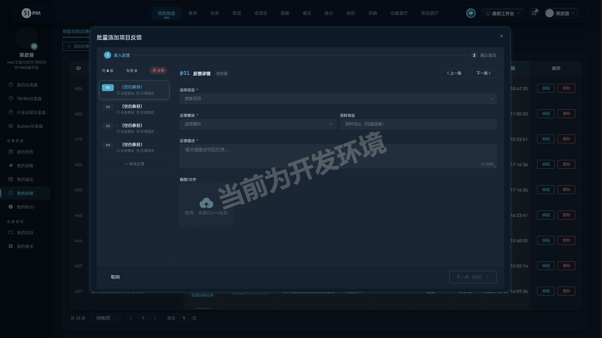
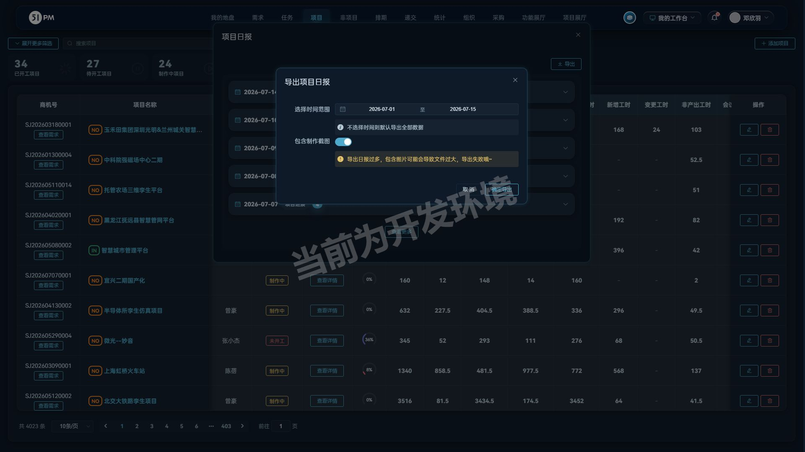
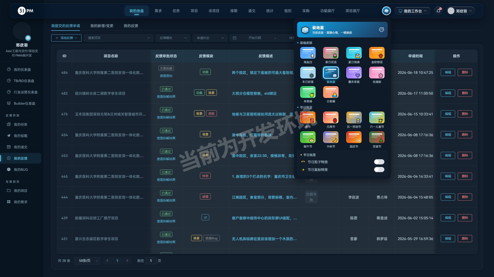
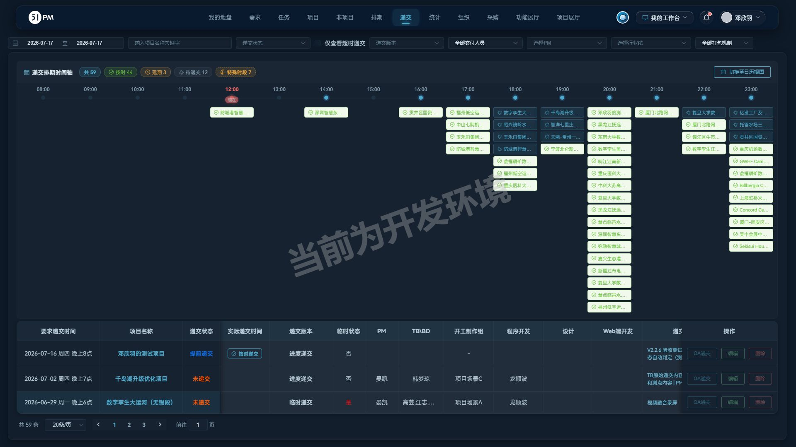

# 51PM V2.2.3 验收报告

- 验收时间：2026-07-17 12:20
- 环境：测试 10.67.8.183:7777
- 验收账号角色：邓欣羽（Web端开发，系统超级管理员）
- **验收结论：4 项需求全部满足**；发现缺陷 1（轻微）、风险/待确认 7
- 老功能回归：✅ 无回归（全量 37 通过 / 4 跳过 / 0 失败，明细见附录 A.1）

> 阅读顺序：先看「一、逐需求验收详情」判断本次交付达标与否 → 「二、缺陷」「三、风险」是待处理项 → 「四、发版初稿」→ 回归与接口等测试证据在附录，供追溯，不是验收结论本身。

## 0. 原始验收需求（开发者提交的本周开发内容）

> 帮我验收 V2.2.3。本周开发内容如下：
> 1. 递交模块：通过递交列表点进项目详情页，再返回递交模块，递交列表被折叠；再次切换到其他模块再返回恢复正常
> 2. 项目日报、统计：日报和花费的导出，时间跨度大了就导不出来，尤其是日报，对于比较复杂的项目一次最多导出半个月的数据。怀疑是日报里包含截图，新增传参选项是都需要包含截图
> 3. 全局组件：项目、非项目、反馈申请的批量创建使用流程不统一，对于用户来说有体验问题，开发一个通用批量表单提交的组件，支持独立、批量、通用、垃圾回收等多功能表单容器，同时兼容不同业务类型
> 4. 主题皮肤：修改各处UI颜色硬编码，地毯走查各个主题配色兼容性。

对应关系：需求 1 → §1，需求 2 → §2，需求 3 → §3（初判 🐛 经用户指正后复验撤销，详见该节），需求 4 → §4

---

## 一、逐需求验收详情

### 1. 递交列表返回折叠修复 — ✅ 满足

- 入口：「递交」→ 递交列表 → 点项目名 → 项目概况 → 返回
- 结论：后退 / 菜单重进两条路径返回，列表均完整展示，未复现折叠。
- 验证证据：
  - UI ✅ 两路径返回，筛选区/时间轴/表格/分页完整
  - 边界 ✅ 再切任务、统计模块往返正常
  - 接口 — 纯前端展示，无独立接口
  - 数据 ✅ 返回后可重查 59 条
- 定妆图 final-递交列表返回不折叠.jpg ｜ 关注：QA、PM ｜ 关联风险 R3

### 2. 项目日报导出「包含制作截图」选项 — ✅ 满足

- 入口：「项目」→ 项目列表 → 查看详情 → 项目日报 → 导出
- 结论：「包含制作截图」开关生效，关闭后大跨度日报可一次导出，命中"一次最多导半月"痛点。
- 验证证据：
  - UI ✅ 配置弹窗含时间范围 + 截图开关 + 过大告警
  - 边界 ✅ 含图 50KB vs 不含图 13KB，证明截图为体积主因
  - 接口 ✅ `export_estimate_list_by_project_id`：正常 200 xlsx；空 project_id→code51；非法 id→空模板不 5xx；include_images=abc→按 false
  - 数据 ✅ 文件大小随 include_images 变化
- 定妆图 final-日报导出含截图开关.jpg ｜ 关注：PM、TB\BD、组长 ｜ 关联风险 R4、R6

### 3. 通用批量表单提交组件 — ✅ 满足（初判 🐛 已撤销）

- 入口（三处实测）：批量添加项目反馈 / 项目需求拆解 / 非项目独立任务·多人通用任务
- 结论：三处统一为同一容器（class 前缀 bcd），独立/通用/批量/垃圾回收四能力齐备，达成"流程统一"。初判"提交后不可见"复验为无 PM 项目数据问题，误判撤销。
- 验证证据：
  - UI ✅ 两步向导 + 条目栏（增/切/全清/完善徽标），未完善禁用「下一步」
  - 边界 ✅ 空白条目自动丢弃、0 有效时禁用、全清可用
  - 接口 ✅ `produce_demand/add_apply_demand`：正常落库；空商机号/空模块→code51
  - 数据 ✅ 提交 #490 后 get_my_demand_list +1 且首行回显
- 定妆图 final-通用批量表单-批量添加反馈.jpg ｜ 关注：PM、TB\BD、工程与交付全员 ｜ 关联风险 R1、R2

### 4. 主题皮肤配色兼容走查 — ✅ 满足

- 入口：顶部主题图标 → 主题面板（10 基础 + 8 节日 + 2 氛围开关）
- 结论：18 主题全量遍历切换生效，品牌色/按钮/表头/激活态跟随主题变量，扫描 0 处旧品牌红硬编码残留，主题跨会话同步（验收后已恢复原「圣诞节」）。
- 验证证据：
  - UI ✅ 18 主题采样四类变量各不相同且一致联动
  - 边界 ✅ 含极地蓝/中秋深色系、节日主题、往返切换
  - 接口 — 前端变量 + 偏好保存，无独立业务接口
  - 数据 ✅ localStorage pm_theme 与服务端偏好同步
- 定妆图 final-主题面板与极地蓝皮肤.jpg ｜ 关注：全员 ｜ 关联风险 R5

---

## 二、缺陷清单（已确认的问题，需修）

> 本轮无功能性 🐛（需求 3 的初判缺陷经复验撤销）；下列为验收中确认的技术缺陷。

| # | 缺陷 | 严重度 | 现场 / 证据 | 建议 |
| --- | --- | --- | --- | --- |
| B1 | 非项目任务表 console 红错 `Duplicate keys detected: 'pause'`（notTaskTable.vue） | 轻微 | 打开非项目任务列表即触发 console error | 修复 v-for key 重复，`pause` 键去重 |

---

## 三、风险与待确认（不确定 / 待拍板口径 / 未覆盖盲区）

> 与缺陷的区别：这些**不是已确认必修的 bug**，而是需要产品/后端确认口径、或本轮验收没覆盖到的盲区。等级按「影响 × 可能性」评。

| # | 事项 | 等级 | 建议 |
| --- | --- | --- | --- |
| R1 | 无 PM 项目可提交反馈申请但无人可审、提交人也看不到（样本反馈申请 #488/#489，项目「CBD物业管理系统」） | 中高 | 下拉过滤无 PM 项目或提交时拦截提示 |
| R2 | 反馈申请 #487（项目「千岛湖」，有 PM、待审批）也不在我的列表，与「有 PM 即可见」不完全吻合 | 低 | 可见性口径可能叠加状态/角色，请产品确认 |
| R3 | 从项目详情返回递交列表后筛选日期重置回今天，易误认为列表被清空 | 中 | 确认"保留筛选状态"是否在本次修复范围 |
| R4 | 统计侧日报导出、花费/成本导出均无"包含截图"选项（开发提到"日报和花费"） | 中 | 确认花费侧是否也应加该选项 |
| R5 | 暗色主题（极地蓝/中秋）个别页面对比度属视觉判断，自动化只验了颜色跟随变量 | 低 | 人工视觉抽查 1~2 个暗色主题页面 |
| R6 | 日报导出对不存在的 project_id 返回空模板 xlsx（200）而非报错 | 低 | 可维持现状或改 code 51 提示 |
| R7 | 「工时数据总览」tab 自带声明"当前为前端 Mock 演示数据" | 中 | 确认该 Mock 页是否应随本版对外可见 |

**未覆盖盲区**：日报导出未验超大数据量极限档（测试库无等量数据）；批量组件未做单批 50+ 条压力录入；主题走查为 4 页 × 18 主题程序化扫描，未逐页遍历全站。

---

## 四、发版内容（初稿，待人工定稿）

### V2.2.3 发布于2026-07-17

#### 影响强度

强度中等，统一项目、非项目与反馈申请的批量创建表单，日报导出支持自选是否包含制作截图，完善全站多主题配色，修复递交列表已知问题。

#### 新增功能

需关注人员：PM、工程与交付全员

1.「批量创建表单（项目/非项目/反馈申请通用）」：（降低批量录入成本，减少逐条创建的重复操作）
项目需求拆解、非项目创建任务（独立任务/多人通用任务）、批量添加项目反馈统一升级为同一套两步式批量表单，
支持左侧条目栏集中管理多条记录（新增、切换、一键全清），实时标记每条完善状态并显示有效条数，
支持"独立模式"逐条填写不同字段、"通用模式"一次填写批量生效（如多人任务一次编辑分配给多人），
确认页仅提交有效条目，空白条目自动忽略，防止误提交；

#### 体验优化

需关注人员：PM、TB\BD、组长

1.「项目日报-导出」新增导出配置：支持选择时间范围（不选则导出全部），并可自选是否包含制作截图；不含截图时大时间跨度日报可一次性稳定导出，减少按半月分段导出的人工操作；

需关注人员：全员

2.「主题皮肤」全站配色兼容性走查：修正各处颜色硬编码，10 款基础皮肤与 8 款节日限定皮肤下按钮、表格、菜单等界面元素配色统一跟随主题，主题选择跨设备同步生效；

#### BUG修复

需关注人员：QA、PM

1.修复了「递交」从项目详情页返回递交列表时列表展示异常的问题，返回后筛选区、递交排期时间轴与列表完整展示；

---

## 附录 A：回归与测试证据（追溯用，非验收结论）

### A.1 全量回归（老功能是否被本次发版改坏）

全量回归 **37 通过 / 4 跳过（@write 写链路默认跳过）/ 0 失败**，用时 3.4 分钟。全部「已知BUG跟踪」哨兵用例维持预期失败（BUG 仍在），无 unexpected pass，**老功能未被本次发版改坏**。

### A.2 接口用例沉淀

本轮接口用例（含完整参数）已固化至 `regression/tests/api-v2.2.3.spec.js`（纯接口回归，不开浏览器，秒级）。各功能的接口验证明细见 §一 各节「验证证据-接口」。

### A.3 验收产生的测试数据

| 数据 | 位置 | 说明 |
| --- | --- | --- |
| 反馈申请 #488/#489（V2.2.3验收/复验-批量表单…（测试数据）） | CBD物业管理系统 (SJ202601230001)，待PM审批 | 无 PM 项目边界样本（对应 R1），无人可审、提交人列表不可见 |
| 反馈申请 #490（V2.2.3复验-批量表单提交流程重走-新耀（测试数据）） | 新耀湃科总部工厂展厅项目 (SJ202405130008)，PM=陈蓓 | 复验样本；提交当日已被 PM 审批「已通过」，进入正常流转（可见性回归用例样本消耗后自动 skip，重提一条即可恢复） |
| 账号主题偏好 | 验收中遍历 18 主题，已恢复为「圣诞节」 | 无残留 |
