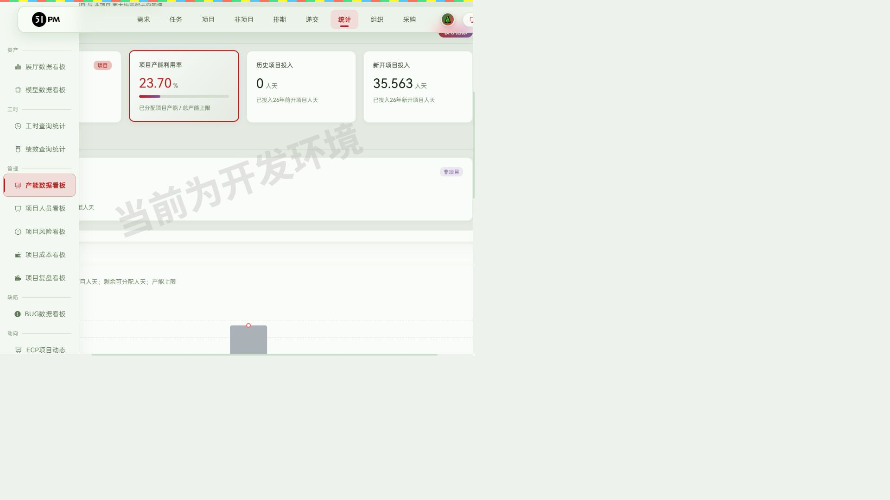
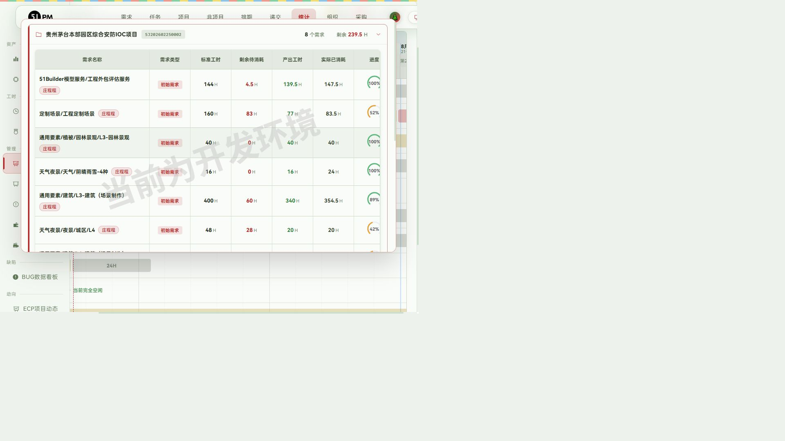
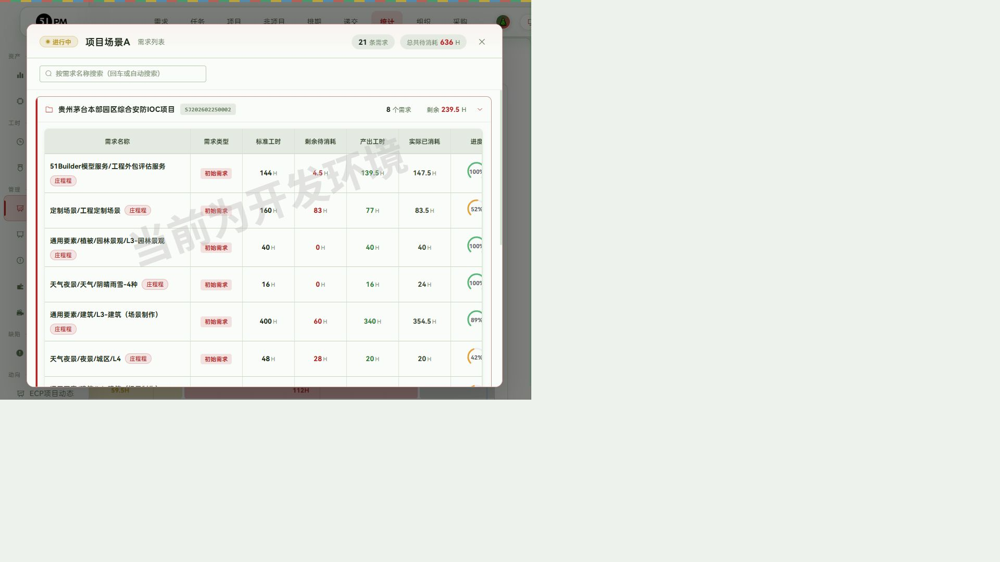
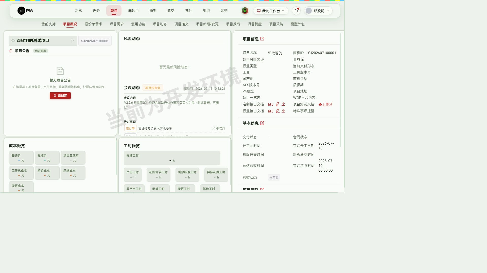
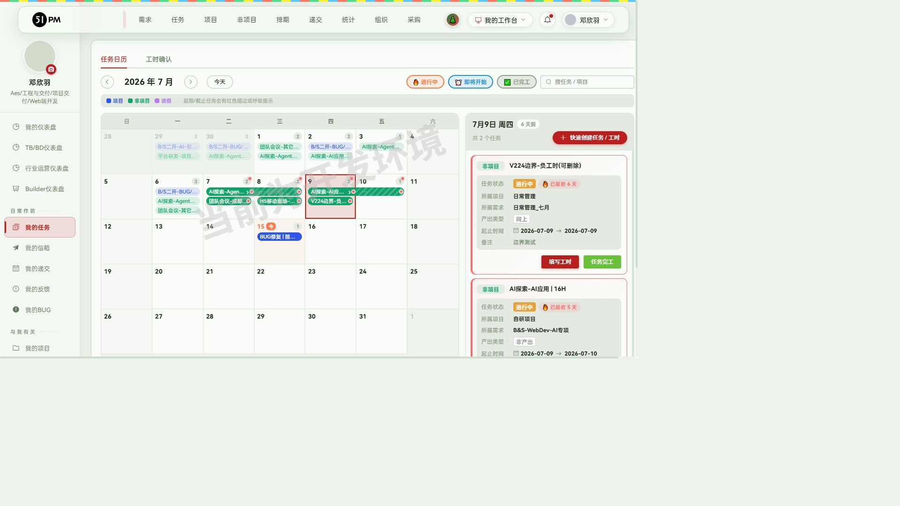
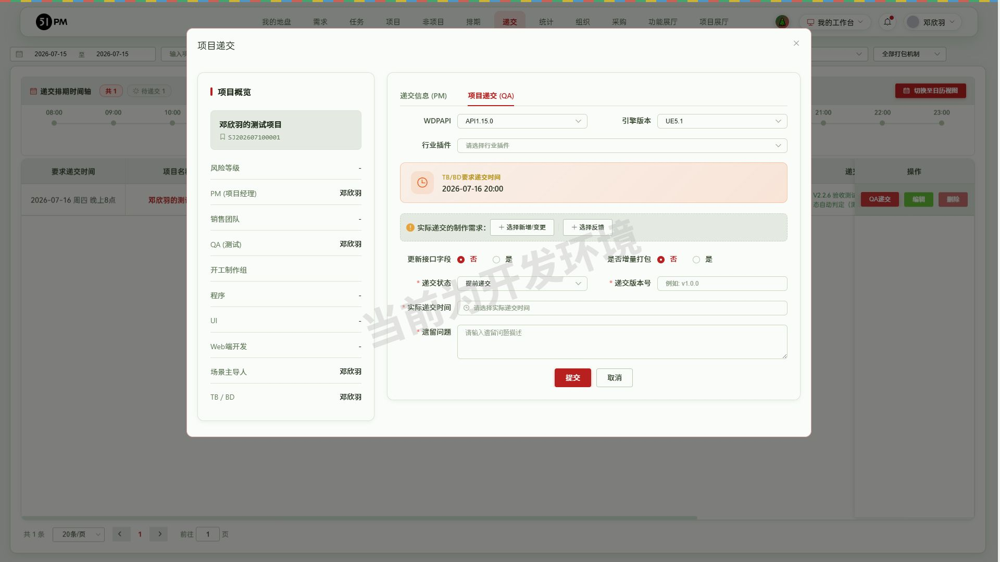
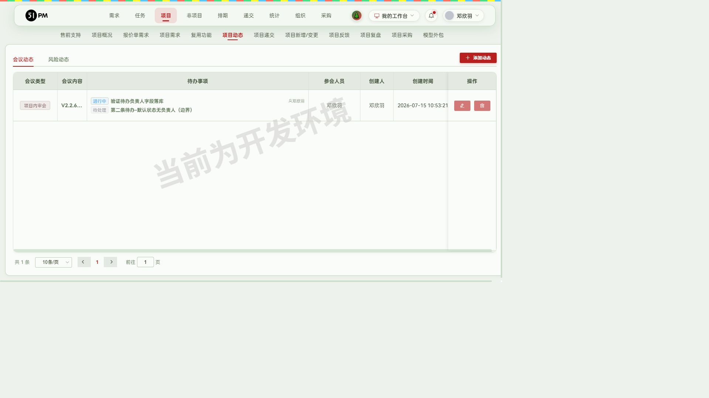

# 51PM V2.2.6 验收报告

- 验收时间：2026-07-15 11:45
- 环境：测试 10.67.8.183:7777
- 验收账号角色：邓欣羽（Web端开发；#6712 项目 PM/TB/QA/场景主导人）
- 覆盖层：每个功能默认覆盖 UI 流程 / 边界 / 接口 / 数据一致性 四层
- 总览：5 项验收，✅5 / 🐛0 / ⚠️0；另有 4 项附随发现待人工确认（不阻断发版，见文丫「交付前需人工确认」表）

## 回归结果（阶段 1）

- `npx playwright test` 只读全量：**8 通过 / 1 跳过（@write）/ 1 意外失败**
- 失败用例「④ 创建任务流程内可就地管理组群」复跑**通过**（首跑时项目需求页偶发空载，非回归 BUG、非数据缺失——需求页现有 3 条需求）
- 哨兵用例「发包详情『任务管理』按钮」仍预期失败（BUG 未修复，绿色）
- **结论：老功能无回归。**

## 0. 原始验收需求（开发者提交的本周开发内容）

> V2.2.6发版内容如下：
> 用户体验：
> 1.工时填写：希望填写工时时，增加显示任务描述，因为DTA的任务全部名称创建在任务描述内，目前无法看到
> 2.递交模块：建议QA在填写递交时，能根据时间自动判定选择"正常递交"与"提前递交"
> 新增功能：
> 3.项目概览：新增行业接口说明书的存放位置，需要区分工程定制接口和行业接口。
> 4.项目动态：希望给会议动态的待办项添加一个选择负责人，以便待办事项的跟进，详见图
> 5.统计-产能数据看板：工程产能分析&小组产能看板（点击对应色块可查看详细内容）

对应关系：需求 1 → §1，需求 2 → §2，需求 3 → §3，需求 4 → §4，需求 5 → §5

## 1. 工时填写显示任务描述 — ✅通过

- 入口：「我的地盘 → 我的任务（日历）」点日历格 → 右侧任务卡片
- 实走流程：1) 进入我的任务日历 2) 点 7月9日格子 3) 核对侧栏任务卡字段
- 结果：任务卡片新增「备注」字段，完整展示任务描述原文。实测两条任务：「V224边界-负工时(可删除)」显示描述"边界测试"；「AI探索-AI应用 | 16H」显示 60+ 字长描述完整不截断；无描述任务不显示异常
- 覆盖层：UI ✅ / 边界 ✅（长文本、无描述空态）/ 接口 ✅（任务列表接口返回的描述字段与卡片展示一致）/ 数据 ✅
- ⚠️ 备注：「填写工时→添加工时」弹窗内部（花费人/日期/花费总计表单）**未**展示任务描述，描述仅显示在日历任务卡上；弹窗标题仅任务名。如需求方期望弹窗内也显示，需开发补充（见人工确认表 #1）
- 截图：final-工时填写任务描述.jpg
- 推断需关注人员：全员（尤其 DTA）
- 【发版素材】「我的任务」日历任务卡新增任务描述（备注）展示，方便填写工时时直接查看 DTA 任务全名；

## 2. 递交状态自动判定 — ✅通过

- 入口：「递交」→ 递交列表行「QA递交」→ 项目递交弹窗「项目递交 (QA)」tab
- 实走流程（为造前置数据走通完整递交链）：
  1) TB/BD 仪表盘 →「立即申请递交」→ 为 邓欣羽的测试项目（#6712）申请进度递交，要求时间 2026-07-16 20:00（递交申请 #423）
  2) 我的信箱 →「审批递交申请(PM)」→ 转化为递交（PM 审批表单）→ 递交创建成功、状态「已排期」
  3) 递交列表筛 7/15~7/17 → 打开「QA递交」弹窗
- **核心断言**：弹窗打开时「递交状态」已自动预选**「提前递交」**（今天 7/15 早于要求时间 7/16 ≥1 天）；下拉仍可手动改（未递交/正常递交/提前递交/延期交付/PM递交 共 5 项）；填版本号 v0.0.1 + 实际递交时间 + 遗留问题后提交成功，列表状态列显示「提前递交」，落库正确
- 判定逻辑（源码确认，`publish_list.vue` 回显逻辑）：当前日期比要求递交日期早 **≥1 天** → 默认「提前递交」，否则默认「正常递交」；控制台有 `[递交状态判断]` 调试日志
- 覆盖层：UI ✅ / 边界 ✅（源码级确认 ±1 天分界）/ 接口 ✅（`project_moment/get_list?project_id=6712&type=1` 返回待办含负责人+状态字段，total=1 与列表一致）/ 数据 ✅（提交后列表与筛选统计一致）
- ⚠️ 备注 1：**晚于要求时间不会自动选「延期交付」**（默认值只有提前/正常两种），延期场景仍需 QA 手动选择——需确认是否符合预期（见人工确认表 #2）
- ⚠️ 备注 2：「QA递交」按钮由**用户名白名单**（`testListRooters`）控制而非项目 QA 角色，验收账号不在白名单，验收时通过 Vue 数据放开展示层门禁后真实点击验证；请确认正式环境 QA 人员均在白名单内（见人工确认表 #3）
- 截图：final-递交状态自动判定.jpg
- 推断需关注人员：QA
- 【发版素材】QA 填写递交时，递交状态根据 TB/BD 要求递交时间自动判定"提前递交/正常递交"，仍可手动调整；

## 3. 项目概览-行业接口文档 — ✅通过

- 入口：「项目 → 项目概况」右侧「项目信息」栏
- 实走流程：1) 进入 邓欣羽的测试项目（#6712）项目概况 2) 核对文档位 3) 分别上传两份 txt 验证
- 结果：项目信息栏依次存在「定制接口文档 / 项目测试文档 / **行业接口文档**」三个独立文档位；「上传行业接口文档」与「上传定制接口文档」各自弹上传窗，上传成功后各生成独立在线链接（projectapi.51aes.com，两个 UUID 不同），**互不覆盖**
- 覆盖层：UI ✅ / 边界 ✅（先后上传互不影响）/ 接口 ✅（上传接口 200、链接可访问）/ 数据 ✅（刷新后两链接保留）
- 截图：final-行业接口文档.jpg
- 推断需关注人员：PM、项目开发、二开
- 【发版素材】项目概况新增「行业接口文档」独立存放位，与工程定制接口文档区分管理、互不覆盖；

## 4. 会议动态待办项负责人 — ✅通过

- 入口：「项目 → 项目动态 → 添加动态（会议动态）→ 待办事项」
- 实走流程：1) #6712 项目动态 → 添加动态 2) 会议类型「项目内审会」+ 会议内容 3) 待办 #1「验证待办负责人字段落库」选状态「进行中」+ 相关人员「邓欣羽」 4) 添加待办 #2（不选负责人，默认「待处理」，边界）5) 参会人员选邓欣羽 → 提交
- 结果：提交成功；列表「待办事项」列回显 每条待办的 状态标签 + 内容 + 负责人（#1 显示"进行中/邓欣羽"，#2 显示"待处理/无人"）；**刷新页面后数据保留**（落库确认）
- 待办可选状态：待处理 / 进行中 / 已完成；负责人下拉为全员人员列表
- 覆盖层：UI ✅ / 边界 ✅（无负责人待办正常保存）/ 接口 ✅（`project_moment/get_list` 返回待办含负责人字段）/ 数据 ✅
- 截图：final-会议动态待办负责人.jpg
- 推断需关注人员：PM
- 【发版素材】会议动态待办事项支持逐条指定负责人与状态（待处理/进行中/已完成），方便待办跟进；

## 5. 统计-产能数据看板 — ✅通过

- 入口：「统计 → 产能数据看板」，路由 `/statistic/capacity_analysis`；页头「工程产能分析 / 小组产能看板」点击切换
- 实走流程与结果：
  - **工程产能分析（部门维度）**：
    1) 「总产能上限」= 该部门总人数 × 天数（285 人天/周）；「非生产成员过滤（8）」按钮弹出排除名单（张皓然、常磊、庄程程、何魏、蔡荣、张炼、周辉、李润芝），支持增删与恢复默认——即"只计算投入生产人员"口径 ✅
    2) 「总待消耗人天」= 未开工需求标准人天 + 进行中需求剩余标准人天 = 540.813，下分**进行中 245.75（45.4%）/ 暂停 206.06（38.1%）/ 未开工 89（16.5%）**三统计，占比合计 100% ✅
    3) 「**产能消耗情况**」合并板块（"项目 与 非项目 两大块产能去向明细"），下分「项目产能」「非项目产能」两个子模块 ✅；项目产能利用率 23.70% = 67.563 / 285 交叉验算一致 ✅
    4) 附：产能趋势图 + 资源分配热力图（成员×日期，8h 饱和度着色）
  - **小组产能看板（小组维度）**：
    5) 「待消耗产能分布图」：118 个工作日 × 12 个小组，甘特图**时间轴仅工作日**（7月13个工作日，跳过周末）✅；色条分 进行中（绿）/ 未开工 / 暂停中（红）✅
    6) 色块 hover 提示换算逻辑：如项目场景A 636H →"11.4 工作日（7人并行）总计约 79.5 人天" ✅
    7) **点击色块下钻**：弹出需求列表明细（项目场景A 进行中 21 条需求 / 总待消耗 636H，按项目分组树状展示，含标准工时/剩余待消耗/产出工时/实际已消耗/进度/起止时间），总计与色块标签一致 ✅
- 覆盖层：UI ✅ / 边界 ✅（非法日期 `start=bad` 静默兜底不报错⚠️建议后端补校验、不存在部门 `dept=999999` 返空不 500）/ 接口 ✅（`data_export/get_employee_project_list` 正常+非法日期+越权部门三组参数均无 5xx，结构完整）/ 数据 ✅（利用率、占比、色块工时三处交叉验算一致）
- 说明：需求图中的"部门维度/小组维度"切换在实现上对应「工程产能分析（部门级）/ 小组产能看板（小组级）」页面级切换，能力等价
- 截图：final-产能消耗情况.jpg、final-小组产能看板.jpg、final-小组产能色块详情.jpg
- 推断需关注人员：PMO、PM、组长
- 【发版素材】见 §发版内容 新增功能第 1 条；

## 接口测试汇总与未覆盖声明

> 各功能的接口验证明细已写在对应功能节的「覆盖层-接口」中；本节只放不隶属单一功能的附带发现与全局声明。全部接口用例（含完整参数）已固化为 `regression/tests/api-v2.2.6.spec.js` 纯接口回归（不开浏览器，秒级）。

**跨功能附带发现**：

| # | 发现 | 证据 | 建议 |
|---|------|------|------|
| 1 | `project_publish/get_list` 的 `project_id` GET 参数疑似未参与过滤 | 不存在 id（99999999）与正常 id（6712）均返回全量 total=12810 | 后端确认参数解析（前端可能走 POST/别名参数）；确实未过滤则修复（确认表 #4） |
| 2 | 前端权限门禁后端未同步：「通过审批」按钮前端按 `systemRole==='PM'` 禁用，但后端审批接口对非白名单用户放行 | 本轮验收即以此创建递交成功 | 后端补角色校验（确认表 #3） |

**未覆盖声明**（如实）：写接口（会议动态提交、QA 递交提交、递交申请/审批）仅覆盖正常路径（UI 真实提交），未做非法参数直调；超长文本/特殊字符/极大数值等极限值本轮未覆盖。

## 交付前需人工确认（汇总）

| # | 事项 | 建议 |
|---|------|------|
| 1 | 「添加工时」弹窗内部未显示任务描述，描述仅在日历任务卡展示 | 与需求方确认"填写工时时可见"是否已满足；不满足则开发补充弹窗内展示 |
| 2 | 实际递交时间晚于要求时间时，递交状态不会自动判定为「延期交付」，仍默认「正常递交」 | 确认是否设计如此（延期需走责任人/原因必填流程，自动选可能误触） |
| 3 | 「QA递交」「通过审批」按钮由用户名白名单（`testListRooters` / PM 硬编码名单）控制，非按项目角色；且后端对 PM 审批接口未做同等校验 | 确认正式环境 QA/PM 名单已维护；建议后端补角色校验 |
| 4 | 接口 `project_publish/get_list` 的 `project_id` GET 参数疑似不生效（任意 id 均返回全量 12810 条） | 后端确认参数解析（前端实际可能走 POST/别名参数）；如确实未过滤建议修复 |

## 验收产生的测试数据（测试环境，无需清理）

- 邓欣羽的测试项目（#6712）：递交申请 #423 + 递交记录（提前递交 v0.0.1，要求 2026-07-16 20:00）、会议动态 1 条（项目内审会，含 2 条待办）、行业/定制接口文档各 1 份、项目测试(QA) 字段设为邓欣羽——均已被 `v2.2.6.spec.js` / `api-v2.2.6.spec.js` 作为数据前置条件引用，勿删

## 发版内容（初稿，待人工定稿）

> 分类依据 release_notes.md 判断表：产能看板/行业接口文档为独立页面/独立文档位 → 新增功能；任务描述展示、递交状态判定、待办负责人为已有模块字段/交互增强 → 体验优化（若定稿希望与原始需求分组一致可将待办负责人上调为新增功能）。

### V2.2.6 发布于 2026-07-XX

#### 影响强度

强度中等，新增产能数据看板与行业接口文档，优化工时填写、递交状态与会议待办体验。

#### 新增功能

需关注人员：PMO、PM、组长

1.「统计-产能数据看板」：（科学评估工程团队与小组承接能力，减少人工盘点产能成本）
「工程产能分析」升级产能计算模型，总产能上限仅统计投入生产人员，支持编辑非生产成员排除名单；总待消耗人天新增"进行中、暂停、未开工"三项细分统计；原项目产能、非项目产能板块合并为「产能消耗情况」，下分"项目产能、非项目产能"两个子模块；
「小组产能看板」新增以小组为维度的待消耗产能分布图，基于工作日时间轴展示各小组进行中（绿色）与暂停（红色）待消耗工时，方便分析哪天能接入新项目、新需求；点击色块可下钻查看需求列表及各项工时明细；

需关注人员：PM、项目开发

2.「项目-项目概况-行业接口文档」：（区分工程定制接口与行业接口，方便统一查阅）
项目信息栏新增「行业接口文档」独立存放位，与「定制接口文档」分开上传、互不覆盖，上传后生成独立在线文档链接；

#### 体验优化

需关注人员：全员

1.「我的地盘-我的任务」日历任务卡片新增任务描述展示，填写工时时可直接查看任务完整描述（DTA 任务全名）；

需关注人员：QA

2.「递交-QA递交」递交状态支持自动判定：根据 TB/BD 要求递交时间与实际时间自动预选"提前递交/正常递交"，仍可手动调整；

需关注人员：PM

3.「项目-项目动态」会议动态待办事项支持逐条指定负责人与状态（待处理/进行中/已完成），方便待办事项跟进；

#### 发布记录表行（供归档）

| 版本号 | 更新时间 | 核心更新内容 | 影响角色 |
|---|---|---|---|
| V2.2.6 | 2026-07-XX | 新增产能数据看板、行业接口文档，优化工时与递交体验 | PMO、PM、QA、组长、全员 |

## 交接给发版技能

定妆图清单：final-工时填写任务描述.jpg、final-递交状态自动判定.jpg、final-行业接口文档.jpg、final-会议动态待办负责人.jpg、final-产能消耗情况.jpg、final-小组产能看板.jpg、final-小组产能色块详情.jpg；各功能【发版素材】段 + 上方「发版内容」初稿，可直接作为发版定稿的输入。
