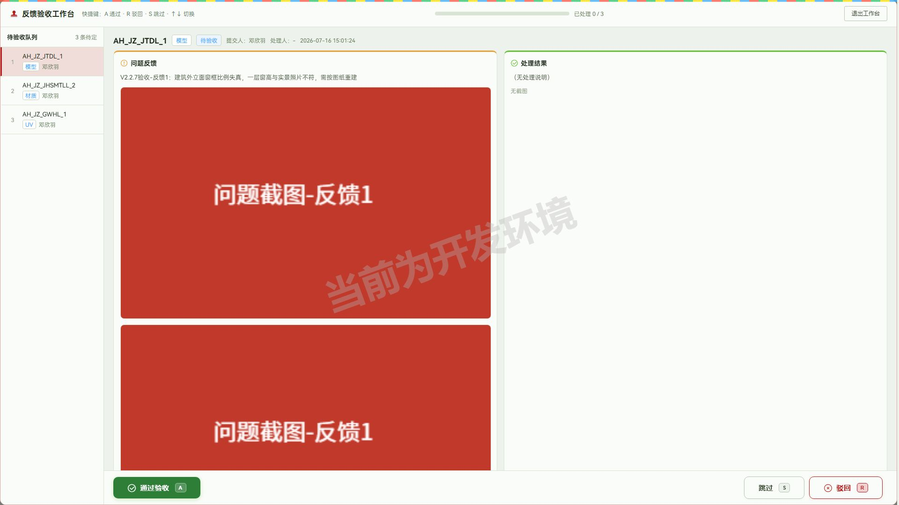

# 51PM V2.2.7 验收报告

- 验收时间：2026-07-16 15:30
- 环境：测试 10.67.8.183:7777
- 验收账号角色：邓欣羽（systemRole=GHOST，isDTA_ADMIN/isDTA_PM 均为 true）
- 覆盖层：每个功能默认覆盖 UI 流程 / 边界 / 接口 / 数据一致性 四层
- 总览：3 项验收，✅3 / 🐛0 / ⚠️0（另有 4 项附随发现待人工确认，见「交付前需人工确认」表）

## 回归结果（阶段 1）

全量回归：**14 通过 / 4 失败 / 1 跳过（@write）**，失败 4 条复跑后稳定失败，逐条核查均为**测试数据缺失，非回归 BUG**：

| 用例 | 失败根因 |
|---|---|
| v2.2.5 ③ 模型外包自制流程要素 | 测试环境数据库刷新：原测试项目（SJ202607100001）**项目记录已消失**，#6712 现指向真实项目「广西盛隆冶金项目增补」；发包 #661/#546 仍在但挂在幽灵 sj_num 下，模型外包列表按项目查不到 |
| v2.2.6 ① 我的任务日历备注 | 测试账号本月日历任务被清空 |
| v2.2.6 ② 递交列表提前递交记录 | #6712 的 V2.2.6 验收递交记录随项目重置消失 |
| v2.2.6 ③ 项目概况接口文档链接 | 接口/测试文档链接随项目重置消失 |

- 「已知BUG跟踪」哨兵用例（发包详情页任务管理按钮无响应）维持预期失败=绿，BUG 未修复。
- **待办**：#6712 已易主为真实项目，回归 spec 的数据前置需按新项目重建（本轮已将功能③数据落在 #24 发包上，见「验收产生的测试数据」）。

## 0. 原始验收需求（开发者提交的本周开发内容）

> v2.2.7发版内容如下：
> 新增功能
> 1.模型外包-反馈验收：验收条目太多，验收的流程繁琐，需要反复弹窗、查看。（开发一个沉浸式逐条验收的工作台，最大化减少管理员的操作，重点到问题截图和修复截图）
> BUG修复：
> 1.项目需求：在拖动调整列宽后出现了表格排版错位的bug（刷新可以解决，但也容易复现）。
> 2.需求下任务花费：人员离职后历史完成任务中的人员信息会消失(注意这个测试的时候不能你去操作离职任何人，你看看其他办法进行验证)

对应关系：需求 1 → §1，BUG 1 → §2，BUG 2 → §3

## 1. 模型外包-反馈验收工作台 — ✅通过

- 入口：「项目 → 项目详情 → 模型外包 → 点发包名进发包详情 → 『反馈管理』tab → 『验收工作台』按钮」；⚠️ 反馈管理 tab 仅**非自制**发包显示（`hideSelfMade:true`，`isSelfMade = self_made_dept_name && self_made_uid`）
- 前置数据：测试环境反馈表为全新空表，本轮在发包「皖江江南建筑模型发包（#24）」下通过**批量创建反馈向导**真实造数 3 条（#520 模型 / #521 材质 / #522 UV，各带 Ctrl+V 粘贴上传截图），再借管理员接口推至「待验收」状态
- 实走流程：
  1. 「创建反馈」→ 批量向导两步（录入条目 → 确认提交）：每条选关联任务（下拉带完工状态）+ 模块（规范/模型/UV/材质）+ 内容 + 截图粘贴上传，侧栏实时显示「有效 N」、下一步按钮计数 (N/5)，确认页逐条复核后「成功创建 3 条反馈」
  2. 「验收工作台」→ 全屏沉浸弹层：顶部快捷键提示（A 通过 · R 驳回 · S 跳过 · ↑↓ 切换）+ 可视化进度条「已处理 0 / 3」，左侧待验收队列（任务名+模块标签+提交人+截图数），中部「问题反馈」（内容+截图），右侧「处理结果」（处理说明+处理截图）
  3. 键盘 `A` → 通过验收：进度 1/3，自动切下一条，落库 quality_status=3
  4. 键盘 `R` → 弹「填写驳回理由」面板：理由必填（空时确认按钮禁用）、0/500 计数、`左Ctrl+Enter 提交 · Esc 取消`；提交后进度 2/3、自动切下一条
  5. 键盘 `S` → 跳过：**不计入已处理**（进度保持 2/3），循环切回已处理条目时操作按钮禁用并提示「该条已处理（通过/驳回），↑↓ 切换其它反馈」
  6. `↑↓` 切换队列条目正常；最后一条 `A` 通过后进度 3/3、0 条待定
  7. 「退出工作台」→ 返回反馈列表自动刷新（待验收筛选下 0 条）
- 覆盖层：
  - UI ✅（全流程真实键盘/点击交互，快捷键 A/R/S/↑↓ 全部生效）
  - 边界 ✅（空队列点「验收工作台」→ toast「当前没有待验收的反馈」不打开工作台；驳回理由空值拦截；跳过条目不计数；已处理条目防重复操作）
  - 接口 ✅（`GET manage_api/outsource_feedback/get_feedback_list?outsource_package_id=24&quality_status=2&limit=999` 工作台全量拉取；`POST manage_api/outsource_feedback/update_feedback_status {id, quality_status, remark}` 通过=3/驳回=1；⚠️ 两个边界发现见「交付前需人工确认」#1、#2）
  - 数据 ✅（落库断言：#520→3 已验收、#521→1 修改中且驳回理由存 `remark` 字段、#522→3 已验收；退出后列表与工作台状态一致）
- 状态机（bundle 实测）：quality_status 0=未受理 → 1=修改中 → 2=待验收 → 3=已验收；驳回=2→1（供应商需重新处理递交）
- 推断需关注人员：DTA 管理员、PM

## 2. 项目需求：列宽拖动排版错位修复 — ✅通过

- 入口：「项目 → 项目详情 → 项目需求」表格列头右缘拖拽
- 实走流程（复现旧 BUG 路径）：在「广西盛隆冶金项目增补（#6712）」需求表格上连续 5 次真实鼠标拖拽（标准价 +60 → 标准成本 +50 → 制作数量 +40 → 标准价 −80 回缩 → 完工状态 +30 → 标准成本 −30），随后横向滚动至表格中部
- 覆盖层：
  - UI ✅（拖拽实时生效：标准价 100→160→80 均正确响应）
  - 边界 ✅（多列连拖、来回缩放、横向滚动、刷新四种旧 BUG 触发条件全验）
  - 接口 N/A（列宽为纯前端渲染，无接口交互，如实声明）
  - 数据 ✅（断言四组：① header/body `colgroup` 逐列宽度全等（含固定列三份渲染）② 表头/表体总宽 2410=2410 ③ 逐列 th 与首行 td 的 x 坐标偏差全部 <1px（0 列错位）④ 固定列与主体逐行 y 坐标 0 错位；刷新后恢复默认布局 2340=2340 仍同步）
- 推断需关注人员：全员（所有使用项目需求表格的角色）

## 3. 需求下任务花费：离职人员历史任务信息保留 — ✅通过

- 入口：「项目 → 项目详情 → 项目需求 → 点需求名称 → 需求任务列表弹窗『指派给』列」
- 验证方法（**未操作任何人离职**，按用户要求采用替代验证）：
  1. 接口对比识别离职人员：`user/get_user_select_list`（在职 385 人） vs `get_all=true`（全量 676 人）→ 差集 291 人为离职名单
  2. 扫描存量项目找到现成案例：「贡井区国资管理平台（#6690）」需求「通用要素/地形/自然地形（郊区野外）/L3-自然地形（#47294）」下 2 条**已完工**任务（道路-道路建模 #47916 / #47839）的 `assigned_to=463` = 已离职的**林智威**
  3. UI 打开该需求任务列表弹窗：两条任务「指派给」列均正常显示「**林智威**」，未出现空白
  4. 交叉验证：林智威确不在在职用户列表（若按旧 BUG 逻辑映射将显示空白）
- 覆盖层：
  - UI ✅（弹窗内 12 行任务，赵一木（在职）与林智威（离职）姓名均完整显示）
  - 边界 ✅（接口 `project_task/get_task_list_by_demand_id`：demand_id 非法值/不存在 → 空列表无 5xx；空参 → code 51「请选择需求」）
  - 接口 ✅（`GET manage_api/project_task/get_task_list_by_demand_id?demand_id=47294` 返回 `assigned_to` 人员 id，离职人员 id 仍完整保留）
  - 数据 ✅（接口 id=463 ↔ UI 显示「林智威」映射一致；离职判定与在职列表交叉核对）
- 推断需关注人员：全员（任务列表数据所有可见角色）

## 接口测试汇总与未覆盖声明

**跨功能/附带发现**：

| # | 发现 | 证据 | 建议 |
|---|---|---|---|
| 1 | `outsource_feedback/get_feedback_list` 的 `outsource_package_id` 传非法值（'abc'）或缺省时**返回全库 522 条反馈**，参数不校验、过滤失效 | GET 直调对比：合法 id 返 3 条，'abc'/缺省返 522 条 | 后端补参数必填与类型校验，避免跨发包数据泄漏 |
| 2 | `outsource_feedback/update_feedback_status` 对**不存在的 id**（999999）返回 code 0 成功，无存在性校验（quality_status 非法值有校验：code 51「状态值无效」） | POST 直调 | 后端补记录存在性校验 |
| 3 | 供应商门户（/supplier_portal）为独立账密登录体系，`handle_feedback`（处理说明/处理截图递交）仅存在于 `supplier_api` 前缀，管理员 token 调用返回 444 | 前缀探测 manage_api 下 404 | 符合预期的权限隔离，无需修复 |

**未覆盖范围声明**：

- 处理说明/处理截图的**供应商侧递交链路**未验（无供应商账号），工作台右栏「处理结果」仅验证了空态展示（「（无处理说明）」/「无截图」），带真实处理截图的双图对照效果待人工复核
- 批量创建反馈向导的「新增反馈」扩容（>5 条）、500 字驳回理由边界未验
- 接口未做并发/极限值压测

api spec 指针：本轮接口用例已沉淀至 `regression/tests/api-v2.2.7.spec.js`

## 交付前需人工确认（汇总）

| # | 事项 | 建议 |
|---|---|---|
| 1 | ⚠️ `get_feedback_list` 参数不过滤返全库（接口发现#1） | 转后端补校验；对外发版不提 |
| 2 | ⚠️ `update_feedback_status` 无 id 存在性校验（接口发现#2） | 转后端补校验；对外发版不提 |
| 3 | ⚠️ 工作台「处理结果」栏带真实供应商处理截图的效果未验（数据无法自造） | 人工用供应商账号处理一条反馈后复核双图对照 |
| 4 | ⚠️ 「验收工作台」按钮在本轮集成浏览器中 locator 点击被 hit-target 判定拦截（报 `info-field__label` 遮挡），键盘 focus+Enter 正常触发；同页签存在系统性坐标偏移，疑为集成浏览器环境问题而非页面 BUG | 人工在真实浏览器点一次该按钮确认可点；低风险 |
| 5 | 测试环境数据库已刷新：原测试项目（SJ202607100001）项目记录消失、#6712 易主为真实项目「广西盛隆冶金项目增补」，回归 spec 多条数据前置失效 | ~~决定是否新建专用测试项目~~ **已定**（2026-07-16 用户确认）：测试库与生产库隔离，不需要专用测试项目，写数据直接挑合适真实项目并带版本前缀；失效的 V2.2.5/2.2.6 数据前置后续按「动态发现→写死ID→失效重扫」模式逐步改造 |

## 验收产生的测试数据

| 数据 | 位置 | 状态 |
|---|---|---|
| 反馈 #520（模型，AH_JZ_JTDL_1，2 张截图） | 发包「皖江江南建筑模型发包（#24）」（项目 SJ202501130001） | 已验收（quality_status=3） |
| 反馈 #521（材质，AH_JZ_JHSMTLL_2，1 张截图） | 同上 | 修改中（驳回，理由存 remark：「V2.2.7验收-驳回测试：材质修复后仍有反光…」） |
| 反馈 #522（UV，AH_JZ_GWHL_1，1 张截图） | 同上 | 已验收（quality_status=3） |
| 上传截图 4 张（v227-fb1.png ×2 / fb2 / fb3） | /storage/project_bug/202607/ | 保留 |

> 注：#24 为真实项目发包，反馈内容均带「V2.2.7验收」前缀便于识别；测试环境不清理。

## 发版内容（初稿，待人工定稿）

### V2.2.7 发布于2026-07-16

#### 影响强度

强度中等，新增模型外包反馈验收工作台，修复已知问题。

#### 新增功能

需关注人员：DTA、PM

1.「模型外包-反馈验收工作台」：（提升批量反馈验收效率，减少管理员逐条弹窗操作）
支持在发包详情反馈管理中一键进入沉浸式验收工作台，逐条聚焦问题截图与处理结果对比；
提供 A 通过 / R 驳回 / S 跳过 / ↑↓ 切换快捷键与可视化验收进度条，驳回时可填写理由供供应商针对性修改；
方便 DTA 管理员集中处理大批量反馈验收工作；

#### BUG修复

需关注人员：全员

1.修复了「项目-项目需求」拖动调整列宽后表格排版错位的问题；
2.修复了「项目-项目需求」需求任务列表中人员离职后历史完成任务的人员信息不显示的问题；
