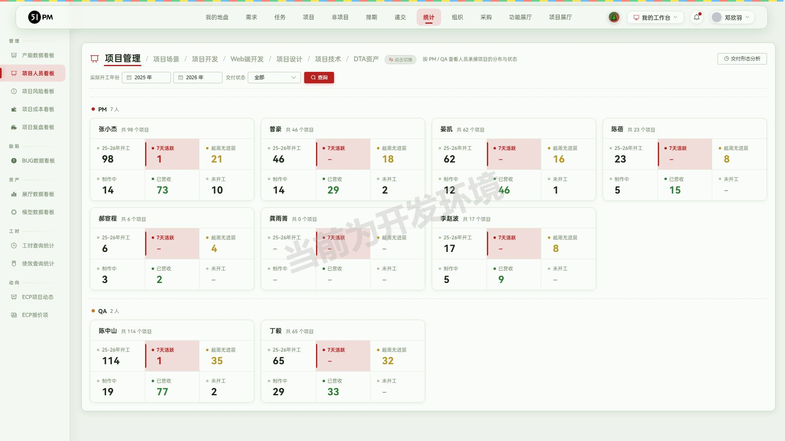
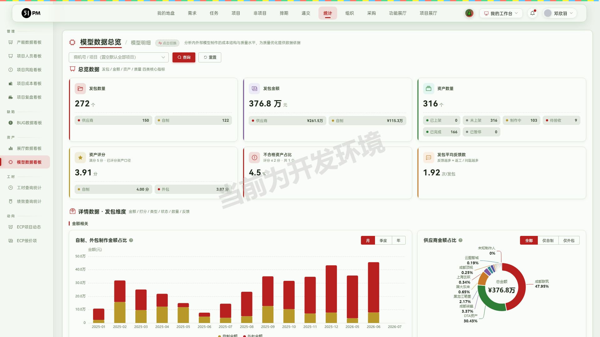
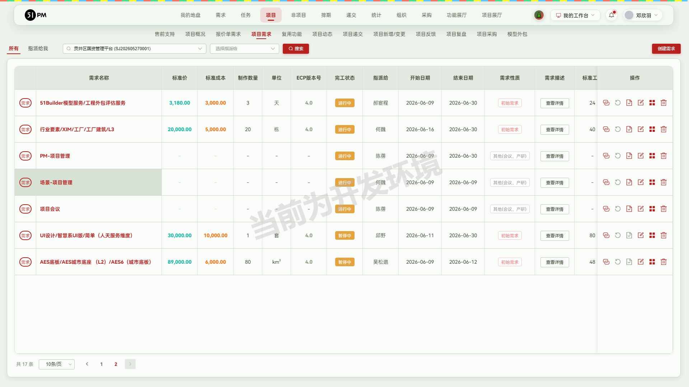
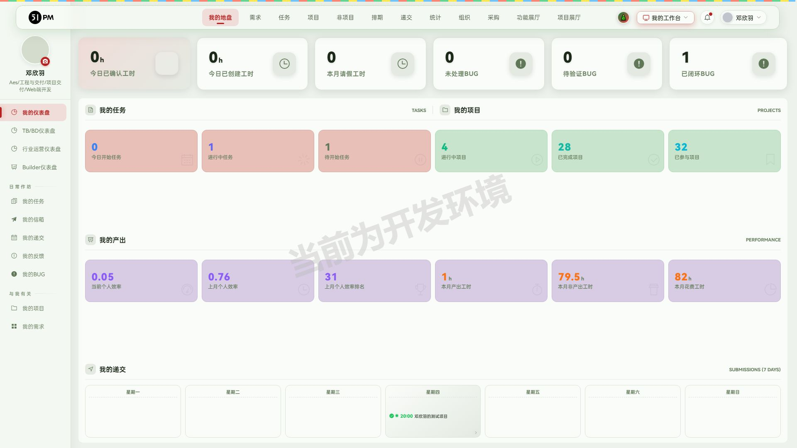
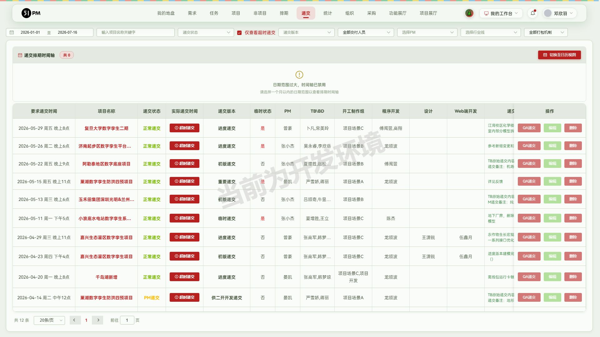

# 51PM V2.2.8 验收报告

- 验收时间：2026-07-16 18:30
- 环境：测试 10.67.8.183:7777
- 验收账号角色：邓欣羽（非 PM、不在递交白名单 testListRooters）
- 覆盖层：每个功能默认覆盖 UI 流程 / 边界 / 接口 / 数据一致性 四层
- 总览：6 项验收，✅6 / 🐛0 / ⚠️0（另有 5 项附随发现待人工确认，见「交付前需人工确认」表）

## 回归结果（阶段 1）

`npx playwright test` 全量只读回归：**23 通过 / 4 失败 / 1 跳过（@write）**，总耗时 2.9m。

4 个失败**全部命中「测试库刷新致数据缺失」铁律**（按规不重建、不复跑）：

| # | 用例 | 缺失数据 |
| - | ---- | -------- |
| 1 | v2.2.5 ③ 模型外包自制流程要素齐全 | 「V225copilot-自制发包复测」发包被清 |
| 2 | v2.2.6 ① 我的任务日历任务卡备注 | 测试账号本月日历无任务 |
| 3 | v2.2.6 ② 递交列表「提前递交」记录 | #6712 的 V2.2.6 验收递交记录消失 |
| 4 | v2.2.6 ③ 项目概况接口文档链接 | 定制/行业接口文档链接为 0 条 |

> **2026-07-17 已改造**：上述 4 例已按「静态要素硬断言 + 数据依赖动态发现→找不到 skip」重写（#2 改为全库筛「提前递交」状态、#1 改为接口扫任意已立项自制发包），改造后 12 通过 / 3 跳过 / 0 失败——测试库刷新不再产生误报红，规范已固化进 SKILL 阶段 3。

哨兵用例（已知 BUG 跟踪）均为预期失败=绿，无 unexpected pass，即历史 BUG 均未修复也未新增回归 BUG。

## 0. 原始验收需求（开发者提交的本周开发内容）

> v2.2.8开发内容如下：
> 1.递交模块：下拉递交状态这儿没有超时递交
> 2.统计-项目成员看板（体现到发版）：项目管理加上测试的两位同事、项目场景-点项目场景A后出现对应组员、tab加上DTA资产和项目技术
> 3.递交审批：API版本缺少2.3.X
> 4.项目需求（体现到发版）：项目需求需要根据 任务最近结束日期 与当前系统日期 做对比，超过2周，需求自动转化为"暂停"状态（项目下的进行中的新增、变更、初始需求，如果两周之内没有新增任务并且没有填过工时就将需求状态改为暂停中）
> 5.统计-模型数据看板（体现到发版）：数据看板开发
> 6.我的工作台-UGA（体现到发版）：开放UGA入口

对应关系：需求 1 → §1，需求 2 → §2，需求 3 → §3，需求 4 → §4，需求 5 → §5，需求 6 → §6。标注「体现到发版」的 2/4/5/6 四项进入发版内容初稿。

## 1. 递交-「仅查看超时递交」筛选 — ✅通过

- 入口：「递交」→ 递交列表 → 筛选区「仅查看超时递交」复选框（递交状态下拉右侧）
- 实走流程：1) 打开递交列表；2) 勾选「仅查看超时递交」；3) 放宽日期范围至 2026 全年查询；4) 核对结果行的要求/实际递交时间；5) 对照组不勾选同范围查询
- 覆盖层：
  - UI ✅：勾选后触发 `is_over_tb_time=1` 过滤，全年 415 条 → 12 条；取消勾选恢复全量
  - 数据 ✅：12 条结果中 10 条实际递交时间确实晚于要求递交时间（如 复旦大学数字孪生二期（递交#14169）要求 05-29 20:00 / 实际 05-29 22:08）；⚠️ 2 条例外见「交付前需人工确认」#1
  - 接口 ✅：`project_publish/get_list?...&is_over_tb_time={v}`——`1`→12 条、`-1`→415 条、`99`→0 条，均 200 无 5xx；⚠️ 非法值 `abc`→403 条（介于两者之间，后端未校验非法枚举，见确认表 #2）
  - 边界 ✅：勾选+当天范围=0 条时列表与时间轴均正常空态展示
- 说明：递交状态下拉本身仍是「未递交/正常递交/提前递交/延期交付/PM递交」5 项，「超时」通过独立复选框筛选实现（与状态枚举解耦，设计如此）
- 定妆图：final-仅查看超时递交.jpg
- 推断需关注人员：QA、PM

## 2. 统计-项目人员看板 — ✅通过

- 入口：「统计」→ 左侧「管理」分组 →「项目人员看板」，路由 `/statistic/pm_panel`
- 实走流程：1) 进入看板默认「项目管理」维度；2) 核对 PM/QA 分组人员；3) 切「项目场景」维度点「项目场景A」展开组员；4) 切「DTA资产」「项目技术」tab 核对数据
- 三个开发点逐项核对：
  - 「项目管理」维度含 QA 分组 2 人（丁毅 65 项目、陈中山 114 项目），与 PM 7 人并列展示 ✅
  - 「项目场景」维度点「项目场景A」就地展开「项目场景A · 组员看板」（庄程程、殷鑫玉等 8 人各自的项目分布卡）✅
  - 维度切换栏含「DTA资产」（任明亮、李鑫等）与「项目技术」（吴松邈、吕桓等 7 人）两个新维度，均有完整数据 ✅
- 覆盖层：
  - UI ✅：六维度（项目管理/项目场景/项目开发/Web端开发/项目设计/项目技术/DTA资产）切换、场景下钻、年份与交付状态筛选均正常
  - 数据 ✅：人员卡「25-26年开工/7天活跃/超周无进展/制作中/已营收/未开工」六指标齐全，抽查场景A组员合计与场景卡总数量级一致
  - 接口 ✅：`data_export/get_user_project?start_year=&end_year=&type={pm|dta|tech}` 均 code 0；非法 `type=abc`、空 type → code 51 优雅报错无 5xx（项目场景维度取数走 tab 内缓存通道，未单独暴露 type）
  - 边界 ✅：龚雨菁 0 项目人员卡正常空态（各指标显示 `-`）
- 环境备注：集成浏览器对场景名点击存在已知 hit-target 坐标偏移（环境问题非产品缺陷），JS click 验证功能本身正常
- 定妆图：final-项目人员看板.jpg；过程图：03-项目人员看板-项目管理含QA.jpg、04-项目场景A-组员看板展开.jpg、05-项目人员看板-DTA资产tab.jpg
- 推断需关注人员：PM、PMO、组长

## 3. 递交审批-API 版本补充 2.3.X — ✅通过

- 入口：「我的地盘 → 我的信箱 → 审批递交申请(PM) tab」→「通过审批」→「转化为递交」表单 →「WDPAPI」下拉
- 实走流程：1) 进我的信箱切审批 tab；2) 打开「转化为递交」表单；3) 展开 WDPAPI 下拉逐项读取；4) 交叉核对递交列表 QA 递交弹窗同下拉
- 覆盖层：
  - UI ✅：WDPAPI 下拉共 17 项，含「API2.1.x、API2.2.x、**API2.3.x**」（附「无」兜底项）
  - 数据 ✅：选项来源接口与前端渲染一致
  - 接口 ✅：`project_publish/get_normal_const` 返回的 WDPAPI 枚举含 `API2.3.x`，code 0
  - 边界 ⚠️：「通过审批」按钮对非 PM 账号前端禁用（`systemRole!=='PM'`，预期门禁）；为验证表单内容通过 Vue 直调 `approvedApply(row)` 打开表单（标准手法，未提交任何数据）
- 定妆图：final-递交审批API版本2.3.x.jpg
- 推断需关注人员：PM、QA

## 4. 项目需求-超2周自动转「暂停中」 — ✅通过（结果态）

- 入口：「项目 → 项目详情 → 项目需求」，路由 `/project/demand?projectId=N`
- 实走流程：1) 接口层扫描 40 个活跃项目的全部需求统计状态分布；2) 定位「暂停中」样本；3) UI 打开 贡井区国资管理平台（#6690）项目需求页翻页核对状态文案
- 覆盖层：
  - 数据 ✅：40 项目需求状态分布 `doing 77 / done 8 / wait 29 / pause 9`；9 条 `pause` 需求全部为任务停滞超 2 周的新增/初始需求（如 UI设计/智慧系UI版/简单（需求#47299）末次任务结束 06-30、AES底板/AES城市底座（需求#47289）末次任务结束 06-12，均距今超 2 周），符合自动转换口径
  - UI ✅：#6690 项目需求页第 2 页两条需求「完工状态」列正确显示「暂停中」，与其余「进行中/未开工」并存无串行
  - 接口 ✅：`demand/get_project_demand_list?project_id=N&limit=&page=` code 0，status 枚举 `doing/done/wait/pause`
  - 边界 ⚠️：定时任务触发时机与「两周内是否填过工时」的排除逻辑无法从前端验证（见确认表 #3、#4）
- 定妆图：final-项目需求自动暂停.jpg
- 推断需关注人员：PM、组长、TB\BD

## 5. 统计-模型数据看板 — ✅通过

- 入口：「统计」→ 左侧「资产」分组 →「模型数据看板」，路由 `/statistic/outsource_panel`；页头「模型数据总览 / 模型明细」切换
- 实走流程：1) 进入总览页核对四类核心指标；2) 交叉验算汇总数；3) 切「模型明细」核对发包/资产两维度列表；4) 接口边界直调
- 覆盖层：
  - UI ✅：总览含发包数量/发包金额/资产数量/资产评分/不合格占比/平均反馈数六卡 + 金额、打分、类型状态、属性质量、省份热力、评分档位等十余张图表；明细页支持发包/资产维度切换与自制/外包筛选
  - 数据 ✅：发包 272 = 供应商 150 + 自制 122 ✅；金额 376.8 万 = 261.5 + 115.3 ✅；明细「发包维度 272 条」「资产维度 316 条」与总览完全一致 ✅；⚠️ 资产状态四档之和 278 ≠ 总数 316（见确认表 #5）
  - 接口 ✅：`outsource/get_data_overview`（period/producer_scope/score_scope）非法 period、空参均兜底返全量 code 0；`get_package_dimension_list` 非法 status 返 0 条不报错；🐛 `get_asset_dimension_list?limit=-5` → **HTTP 500**（`slice bounds out of range [:-5]`，见确认表 #6）
  - 边界 ✅：未上架 316/已上架 0、已暂停 0 等零值卡展示正常
- 定妆图：final-模型数据看板.jpg；过程图：06-模型明细-资产维度.jpg
- 推断需关注人员：DTA、PM、PMO

## 6. 我的工作台-UGA 入口 — ✅通过

- 入口：顶栏「我的工作台」下拉菜单 → 「UGA」级联项（位于组群配置与版本控制之间）
- 实走流程：1) 展开工作台菜单确认 UGA 项存在；2) hover 展开级联二级菜单；3) 点击「正式」入口验证跳转行为；4) 探测目标站可达性
- 覆盖层：
  - UI ✅：UGA 级联展开 3 个环境入口（正式 / hzh / wsm）
  - 交互 ✅：点击触发 `window.open('http://10.2.13.121/entry?t=<oauthToken>&uid=475&from=51pm')`，携带登录态与用户标识免二次登录
  - 接口 ✅：UGA 正式站 entry 页 HTTP 200 可达
  - 边界 ⚠️：token 以明文 query 传递（见确认表 #7）；集成浏览器拦截弹窗，跳转行为经 window.open 拦截探针确认（环境限制非产品缺陷）
- 定妆图：final-工作台UGA入口.jpg；过程图：07-UGA级联三环境入口.jpg
- 推断需关注人员：全员

## 接口测试汇总与未覆盖声明

跨功能/附带发现（明细已在各功能节「覆盖层-接口」行）：

| # | 发现 | 证据 | 建议 |
| - | ---- | ---- | ---- |
| 1 | `outsource/get_asset_dimension_list` 负数 limit 触发 500（slice panic） | `limit=-5` → HTTP 500 `slice bounds out of range` | 后端对分页参数加非负校验 |
| 2 | `project_publish/get_list` 的 `is_over_tb_time` 非法枚举不校验 | `abc` → 返回 403 条（既非全量也非超时集） | 非法值应报 code 51 或按默认值处理 |
| 3 | UGA 跳转 URL 携带 oauthToken 明文 query | `entry?t=<token>&uid=` | 评估改为一次性 code 交换，避免 token 进日志/Referer |
| 4 | 「通过审批」前端禁用但 Vue 层方法可直调开表单 | approvedApply(row) 成功打开 | 后端确认审批提交接口有角色校验（本轮未提交，未验后端） |

未覆盖声明：①需求自动暂停的**定时任务触发时机**与**工时排除条件**未验（无后端任务观测手段）；②UGA 目标系统内部功能未验（越权范围）；③递交审批「通过审批，创建递交」**提交链路**未走（避免对真实申请单产生审批数据）；④模型看板图表数值与底层明细的逐图核对仅抽样（发包数/金额两项全核对）。

接口回归用例沉淀：见 regression/tests/api-v2.2.8.spec.js（阶段 3 产物）。

## 交付前需人工确认（汇总）

| # | 事项 | 建议 |
| - | ---- | ---- |
| 1 | 超时递交筛选结果含 2 条实际递交**早于**要求时间的记录：千岛湖新增（递交#14076，早 2h）、巢湖数字孪生防洪四预项目（递交#14057，status=4 PM递交，早 1h） | 确认超时判定口径（是否按其他时间字段或 PM 递交特殊规则），若为误算需修 |
| 2 | `is_over_tb_time=abc` 返回 403 条 | 后端补参数校验 |
| 3 | 需求自动暂停的定时执行周期未知（每日？每小时？） | 与后端确认，便于回归用例设计 |
| 4 | 需求#56144（皖江项目#6708，新增类，末次任务结束 06-29 距今超 2 周）仍为「进行中」 | 人工核对该需求近两周是否填过工时——有则符合排除条件，无则为自动暂停漏网 |
| 5 | 模型看板资产状态四档（制作中103+待验收9+已完成166+已暂停0=278）≠ 资产总数 316，差 38 | 确认是否存在未展示的状态档（如未开工），需要则补档位 |
| 6 | `get_asset_dimension_list` 负数 limit 500 | 后端修复（同接口汇总表 #1） |
| 7 | UGA 跳转 token 明文 query | 安全评估（同接口汇总表 #3） |

## 验收产生的测试数据

本轮验收**全程只读**：所有弹窗（编辑递交信息、项目递交、转化为递交、申请递交）均打开查看后取消，未提交任何表单；筛选/翻页操作不落库。**无新增测试数据**。

## 发版内容（初稿，待人工定稿）

### V2.2.8 发布于2026-06-29

#### 影响强度

强度中等，新增项目人员看板与模型数据看板，完善需求「暂停中」自动流转，开放UGA快捷入口。

#### 新增功能

需关注人员：PM、PMO、组长

1.「统计-项目人员看板」：（减少人工盘点各组项目负担，方便按人员跟踪项目推进）
支持按项目管理（PM/QA）、项目场景、项目开发、项目设计、项目技术、DTA资产等维度查看成员承接项目的分布与状态，每人展示开工、7天活跃、超周无进展、制作中、已营收、未开工六项指标；
「项目场景」维度以小组为单位展示项目场景A/B/C/D整体情况，点击场景名可下钻查看组内成员看板，支持按开工年份与交付状态筛选；

需关注人员：DTA、PM、PMO

2.「统计-模型数据看板」：（沉淀模型发包数据，量化内外部制作成本与供应商交付质量）
「模型数据总览」提供发包数量、发包金额、资产数量、资产评分四类核心指标，区分供应商与内部自制口径，并提供金额占比、供应商质量评分排行、发包类型状态占比、资产属性质量、省份热力分布、评分档位分布等图表；
「模型明细」支持发包维度与资产维度切换，展示每笔发包的评分、反馈数、制作日报、预估/报价人天、金额与交付时间明细，支持按自制/外包等条件筛选；

需关注人员：PM、组长、TB\BD

3.「项目需求-暂停中状态自动流转」：（及时暴露停滞需求，保证需求进度与产能统计准确）
项目下进行中的新增、变更、初始需求，若连续两周未新增任务且未填报工时，系统自动将需求状态转为「暂停中」；
需求列表完工状态列直接展示「暂停中」标识，方便识别停滞需求并及时跟进；

#### 体验优化

需关注人员：全员

1.「我的工作台-UGA入口」：支持从工作台菜单一键跳转UGA系统（正式与开发环境多入口），自动携带登录态免重复登录，方便快捷进入UGA开展工作；

需关注人员：QA、PM

2.「递交-超时递交筛选」：递交列表新增「仅查看超时递交」筛选项，支持一键过滤出超时递交记录，方便复盘递交超时情况；

需关注人员：PM、QA

3.「递交审批-API版本」：递交表单WDPAPI版本选项补充API2.3.x，保持与最新API发布节奏一致；

#### 发布记录表行（摘要，供人工定稿参考）

| 版本号 | 更新时间 | 核心更新内容 | 影响角色 |
| ------ | -------- | ------------ | -------- |
| v2.2.8 | 2026-06-29 | 新增项目人员看板与模型数据看板，完善需求暂停机制，开放UGA入口 | 全员、PM、组长、DTA |
