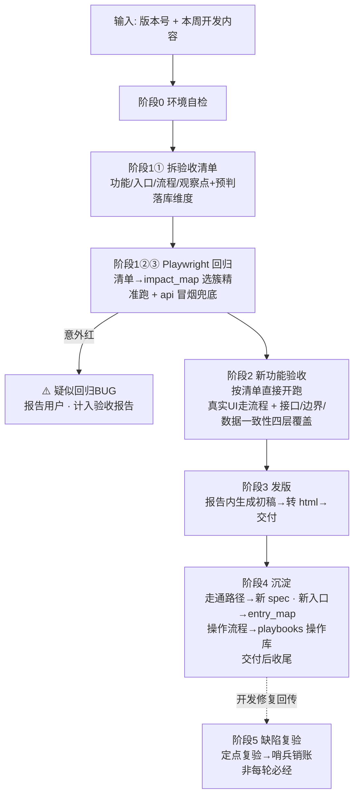

# 51PM 验收-测试-发版 · 全流程总控 SKILL

> **一句话**：用户在 VS Code Copilot 对话框贴「版本号 + 本周开发内容」→ agent 依次跑
> **① 回归（老功能）→ ② 验收（新功能）→ ③ 发版（初稿写进报告并转 html 交付）→ ④ 沉淀（用例+入口）**，
> 每阶段有明确产物。本 SKILL 是调度器，各阶段细节委托给专项 skill 文档。

## 架构总览



## 目录与产物约定

| 内容 | 位置 |
| --- | --- |
| 回归脚本 | `regression/tests/v{版本}.spec.js`，公共封装 [helpers.js](../regression/tests/helpers.js) |
| 验收报告 + 截图 | `acceptance/{版本}/acceptance-report.md` + `.html` + `final-*.jpg`；有缺陷时另出 `fix-handoff.md`（开发修复交接物，规范见 release_acceptance.md 第 4 步） |
| 入口地图（全 skill 共享） | [entry_map.md](entry_map.md) —— 找入口先查、新入口必回填 |
| 影响面索引（全 skill 共享） | [impact_map.md](impact_map.md) —— 功能↔共享表/接口，反查回归目标；新功能确认落库口径后必回填 |
| 操作库 / Playbooks（SOP） | [playbooks/](playbooks/) —— 每个功能「怎么做完一件事」的分步流程，供人/操作型 AI 复用 |
| 发版最终文档（agent 不维护） | 用户自行在发版管理中定稿更新；agent 交付终点 = 验收报告内的初稿节 |

## 关键环境信息

| 项 | 值 |
| --- | --- |
| 测试环境 | `http://10.67.8.183:7777`（右侧有"当前为开发环境"水印；**验收默认此环境**） |
| 正式环境 | `http://51pm.51aes.com:771`（写操作逐项先问用户；两个 host 均不外发） |
| 后端 API | 真实后端 `10.67.8.189:8888`。**IP 会漂移**（2026-07-21 前从 .183 迁到 .189），单一真源见 [start-proxy.js](../regression/scripts/start-proxy.js) 的 `TARGET_HOST`。前端写死 `localhost:8888` → 回归 globalSetup 自动起本机转发（单独常驻 `npm run proxy`）。判断当前后端 IP：浏览器打开 app 看 performance 里 `manage_api` 请求 host |
| 测试数据 | 测试库与正式库完全隔离、真实项目只是副本 → **任意项目均可随便挑、直接写，无污染顾虑，不需专用测试项目** |
| 登录 | 企微 OAuth；登录态过期（用例批量跳登录页）→ 提示用户重跑 `npm run login`，**agent 不代输任何凭据** |

---

## 阶段 0：环境自检（每轮开跑前）

```powershell
cd regression
# 1. 依赖就绪？（首次或环境恢复才需要）
if (!(Test-Path node_modules)) { npm install; npx playwright install chromium }
# 2. 登录态有效性自检（关键：文件存在 ≠ token 有效）
npm run check     # 退出码 0=有效可继续；2=已过期→停下提示用户 npm run login；3=后端不可达/IP 漂移
```

### ⭐ 登录态自检必须在阶段 0 做，别等阶段 1

`npm run check` 用存档 token 直连后端打认证接口，秒级判断有效/过期（有效 `code=0`，过期 `code=444 用户不存在`）。

> **只 `Test-Path auth/state.json` 是错的**——token 会因 SSO 过期而失效，文件却还在；不自检就会白跑 10+ 分钟全红回归再被误判成后端宕机（2026-07-21 V2.2.4 轮教训）。

**退出码 2（已过期）**：需用户扫码续登，**agent 不代扫任何凭据**。

- ⚠️ **扫码务必走 VS Code 集成浏览器，别用 `npm run login`**——`npm run login` 会另开一个独立的有头 Chrome 窗口，常被其它窗口挡住/弹到屏幕外，用户根本看不见二维码（2026-07-21 V2.2.4 轮用户连问三次"扫码在哪"的教训）。
- 正确姿势：
  1. 用集成浏览器 `open_browser_page` 打开 `http://10.67.8.183:7777/` → app 401 会自动跳 `cas-test.51aes.com/loginPage`，二维码 iframe 就显示在 VS Code 里，用户可见即扫；
  2. 用户扫完页面回 `my_board/main/main` 后，`page.evaluate(()=>localStorage.getItem('oauthToken'))` 取新 token，**直接改写 `auth/state.json` 里 origins 的 `oauthToken` 值**（集成浏览器 `Storage.getCookies` 不可用、拿不到 httpOnly 的 SESSION，但后端鉴权走 `Bearer token`，只更新 oauthToken 即可让 `npm run check` 通过 `code=0`）；
  3. 重跑 `npm run check` 确认有效再进阶段 1。
- 仅当集成浏览器扫码走不通时才回退 `npm run login`。

**退出码 3（后端不可达）**：多半是后端 IP 又漂移了——浏览器打开 app 看 performance 里 `manage_api` 的真实 host，改 [start-proxy.js](../regression/scripts/start-proxy.js) 的 `TARGET_HOST`（全仓库后端地址单一真源，proxy 与 check 都引用它）。

### 环境固定

固定为测试环境 `10.67.8.183:7777`，不再询问。仅当用户明确说「正式环境」才切换，且写操作逐项问。

## 阶段 1：拆清单 + 按影响面精准回归（清单先行，不全量盲跑）

> **回归 = 新功能碰哪块老地盘就回归哪块**（影响面驱动）。顺序为：先把 dev_notes 拆成验收清单（一次解析、阶段1 选集与阶段2 验收两处复用），再由清单的「预判落库维度」查 [impact_map.md](impact_map.md) §B 选回归目标。**UI 全量不再默认跑**，兜底改用 api 冒烟（纯接口秒级）。

### ① 拆验收清单（原阶段2 第1步，前移至此）

按 [release_acceptance.md](release_acceptance.md) 第 1 步模板对 dev_notes 逐条产出「功能名 / 推测入口（先查 [entry_map.md](entry_map.md)）/ 计划流程 / 观察点」，并**每项追加一行「预判落库维度」**——该功能落在哪张表/哪个接口命名空间（即 impact_map §A 的维度；拿不准就多标几个候选，宁多勿漏）。清单输出后不等用户确认，直接进 ②。

### ② 精准回归（主力）

```powershell
cd regression
# 清单「预判落库维度」命中哪些簇就跑哪些标签
#    标签=impact_map §B 簇名（@project_publish/@project_moment/@demand/@project_task/
#    @outsource/@user_group/@schedule/@data_export/@estimate/@project_detail/@task_options 等）
npx playwright test --grep "@project_publish|@project_moment"   # 示例：本轮碰递交+项目动态
# 需要真实写链路时（会产生测试数据）：
$env:RUN_WRITE=1; npx playwright test --grep @write
```

- 汇总清单各项的「预判落库维度」→ 查 impact_map §B 得命中簇 → `--grep "@簇A|@簇B"` 跑这些簇的全部老功能用例。命中「独立维度」（produce_demand/pm_theme/uga）的功能基本不外溢，只回归自身。
- **精准选集覆盖「全部命中簇」，簇多不是转全量的理由**：碰几个簇就 grep 几个簇，`@A|@B|@C|@D|@E` 可任意叠加——发版内容多、跨簇多，依然是把这些簇**全部精准跑**（这才是"精准测全部"），而不是因为簇多就退回盲跑全量（全量只会把**没碰的簇**也跑一遍，纯浪费）。

### ③ 轻量冒烟兜底（替代 UI 全量）

```powershell
npx playwright test tests/api-*.spec.js   # 全部 api spec：不开浏览器，秒级跑完
```

- api spec 覆盖多簇后端契约（列表结构/边界参数/已知BUG哨兵），后端被改坏最先从接口层暴露，是低成本的漏判安全网。
- **UI 全量（`npx playwright test`）只在「影响面根本界定不了」时才兜底**：a) 清单里功能↔簇的映射**普遍拿不准**（单功能候选维度 ≥3 且难取舍），或改动是全局底座（登录/路由/全局布局/主题引擎等）无法归到具体簇；b) 阶段2 验收实锤口径与预判不符 → 补跑**差集簇**的 `@标签`（仍是精准，不必全量）。**"碰了 N 个簇"本身（N 再大）不触发全量——碰到的簇全 grep 上即可。**
- ②③ 结果均按下表判读。

结果判读（三种颜色三种动作）：

| 结果 | 含义 | 动作 |
| --- | --- | --- |
| 全绿 | 老功能没被本次发版改坏（含哨兵用例：BUG 仍在 = 预期失败 = 绿） | 直接进阶段 2 |
| 「已知BUG跟踪」用例 unexpected pass（红） | 开发已修复该 BUG，哨兵用例的 `test.fail()` 标记过时 | 删掉 `test.fail()` 转常规断言，并把 BUG 从 entry_map 备注中销账 |
| 预期内规格变更用例红（dev_notes 已声明本轮改了该老功能） | **不是回归 BUG**——旧用例断言的是重构前规格，代码已按新规格改 | 该老功能本轮即验收对象；标记后**进阶段 4 就地更新其旧版本 spec 用例**（改断言/迁移/删除），不当 BUG、不新写并存用例 |
| 其他用例意外红 | 疑似回归 BUG（dev_notes 没提却红 = 重构副作用波及） | 先复跑一次排除偶发；仍红则看现场，作为 🐛 记入报告继续往下跑，**不中断等用户** |

- 回归失败排查顺序：登录态过期（批量跳登录页，**阶段0 `npm run check` 应已拦住**）→ 8888 转发没起/后端 IP 漂移 → 测试库刷新致数据缺失 → 才是真回归 BUG。
- 🚫 几乎全红时**第一动作是 `npm run check` 复核，严禁凭裸 TCP（`Test-NetConnection`/`node http` 直连后端端口）就断言「后端宕机」**（2026-07-21 V2.2.4 轮误判教训——refused/`socket hang up` 会误导，正常应已被阶段0 拦住）。仍要深挖看 `test-results/*/error-context.md` 是 `401/登录失效` 还是连接错误。
- **测试库刷新致数据缺失**：失败报错含「测试数据缺失 / 被清空需先重建」时，**不要重建数据、不要复跑、不要继续耗时间**——立即终止本轮回归，在报告顶部回归徽章与附录 A.1 标注「回归跳过：测试库刷新致数据缺失」并列出受影响用例，直接进阶段 2。数据重建只在用户明确要求时做。
- 回归结论（x 通过 / y 失败 / 哨兵状态）写进阶段 2 报告的**顶部回归徽章（一行）+ 附录 A.1**，不再当开篇头条。

## 阶段 2：新功能验收（半自动，核心阶段）

**全文遵循** [release_acceptance.md](release_acceptance.md)（拆清单模板 / 四层检查维度 / 截图规范 / 结论分级 / 报告模板 / 发版内容初稿），本节只列调度要点与新环境适配：

1. **按清单直接开跑**：验收清单已在阶段 1 ① 产出（含「预判落库维度」行），此处不重拆、直接按清单逐项验收；查不到入口的标"待现场找"现场探索。仅当开发内容有明显歧义、无法推进时才提问。一次只带 1~2 个功能，多了分批。**验收中实锤的落库口径若与清单预判维度不符，回到阶段 1 ③ 补跑差集簇的回归**（影响面纠偏闭环）。
2. **必须真实 UI 交互**：验收是在验交互本身——点不动的按钮就是 🐛 发现，禁止用 JS 直写绕过。读 Vue data / DOM 只用于**数据断言**，不代替操作。
   - **唯一例外：前置数据准备撞上权限门禁**。造前置数据的环节（非被验功能）遇到前端角色/白名单禁用按钮（如 PM 审批 `systemRole!=='PM'`、QA递交 `testListRooters` 白名单）时的标准手法：
     - **不要尝试右上角切换角色**（切回可能触发重新扫码，登录态报废），也不要对着禁用按钮死循环重试；
     - 标准手法：读按钮 Vue 组件找到背后的处理方法（如 `approvedApply(row)`）直接调用打开表单，后续表单交互仍走真实点击；
     - 同时把「前端禁用但后端放行」作为 ⚠️ 写进报告（后端缺校验线索）。
3. **执行载体（新环境适配）**：优先用 Copilot 浏览器工具（打开页面、点击、截图）现场探索；复杂流程可写临时 Playwright 脚本（复用 `helpers.js` 里的坑规避封装：公告弹窗关闭、可见 dialog 过滤、双份渲染过滤等）。临时脚本验完即弃或直接进化为阶段 4 的正式用例。
4. **四层覆盖**：每个功能默认过「UI 流程 / 边界 / 接口层 / 数据一致性」，验不了的层在报告标 ⚠️+原因。其中接口层是**硬性要求**：每个功能至少直调 1 次核心接口（页面内 `fetch` 复用会话）验边界参数（非法值、越权 id、空参），并把接口路径+关键参数记进报告与 entry_map 备注（供阶段 4 沉淀接口回归用）。**顺带记下该功能的「创建/更新接口」**（路径 + payload 形态 + 关键字段），哪怕本次只读——它是阶段 4「动作型自造」造前置数据的原料，下一轮回归靠它自给自足（payload 形态可在验收走创建流程时抓 POST 反推）。
5. **截图纪律**：只截三类——关键结果页（每功能 1~2 张）、BUG 现场（必截）、定妆图 `final-{功能名}.jpg`（每功能 1 张，发版文档引用）。落盘 `acceptance/{版本}/`。
   - **交付截图一律用 headless Playwright 脚本截，禁止用集成浏览器出图**（集成浏览器视口会被 VS Code 回弹到 ~1390，截图右 1/4 留白；详见 [release_acceptance.md](release_acceptance.md)）。集成浏览器只做探索交互；验收尾声用 `regression/scripts/headless-login.js`（launchLoggedIn+shot，登录/公告/视口断言已封装）写一个重放脚本把全部交付截图一次截完。
6. **结论分级（三条正交轴，不混用一个符号）**：
   - **验收结论/需求**：✅满足 / 🟡部分满足 / ❌不满足（写在 §一 各需求节标题，不另列汇总表）；
   - **缺陷 BUG**：已确认必修——报告 §二 只写 PM 话术一句话+严重度+建议，复现/定位线索/通过标准等技术细节写 `acceptance/{版本}/fix-handoff.md`（开发交接文档，有缺陷才生成，规范见 release_acceptance.md 第 4 步）；
   - **风险 Risk**：按影响×可能性定级（写 §三），口径待定/覆盖盲区/健壮性仅用于判断、不单列成表列。
   - 关键："没验到"是风险里的覆盖盲区、"待产品确认口径"是风险，都不是缺陷。
7. **报告**：按 release_acceptance.md 第 4 步模板写 `acceptance/{版本}/acceptance-report.md`（逐需求详情为主线、结论内嵌每节标题、缺陷与风险分家、回归沉附录），顶部放一行回归徽章（阶段 1 结论）+ 附录 A.1 放回归明细；实体一律写「名称（#ID）」。
8. **本阶段暂不转 HTML**：只写报告 md；html 统一在**阶段 3 发版初稿回填报告之后**转一次（否则 html 缺发版节）。转换细节见阶段 3 与 [release_acceptance.md](release_acceptance.md)。

## 阶段 3：发版（初稿必做，报告写全→转 html→交付）

1. **生成初稿**：**只依赖两个输入：本轮验收结果 + [release_notes.md](release_notes.md) 规范**（分类判断表 / 强度规则 / 句式 / 红黑榜 / 命名规范，必须真正读取并逐条套用，不许凭感觉写）。**不读、不碰发版记录/发版.md——任何阶段都不碰**（定稿与归档由用户在发版管理自行完成，agent 只专注输出验收报告；历史版本归属拿不准时在初稿里标 ⚠️ 留待定稿判断，不去翻历史）。四个高频判错点：
   - 产出物是全新能力/独立页面 → **新增功能**，哪怕挂在已有页面上
   - 新增用户可感知核心能力 → 强度至少**中等**；强度按 **dev_notes 全部条目**判（含未验收/验不了的条目；dev_notes 即本次发版范围，不去翻发版记录确认）
   - 🐛 对外**转正向表述**，不暴露"曾出异常"；内部 BUG 放报告 §二 缺陷 / §三 风险节
   - 价值括号写业务结果（降低成本/减少人工），不写功能能力（支持XX）
2. **初稿写进验收报告**的「## 发版内容（初稿，待人工定稿）」节——不落独立文件；定妆图直接引用 `acceptance/{版本}/final-*.jpg`，不拷贝。
3. **转 HTML（全流程唯一一次转换，发版初稿写回之后才转）**：至此报告 md 已写全（验收结论 + 各需求详情 + 缺陷/风险 + 发版初稿 + 附录回归），转成 html——md 与 html 是同一份完整交付物。转换命令、排版与踩坑见 [release_acceptance.md](release_acceptance.md)；pandoc 不可用时用任何等效 md→html 手段，保持相对路径图片可见；转换失败不阻断，md 是主产物。
4. **交付**：把报告与截图目录路径发回用户（Windows 格式）；有缺陷时提醒 `fix-handoff.md` 可直接转给前后端开发（整份投喂 AI），修复回传后走阶段 5。**至此对外交付物完成**，定稿与归档由用户在发版管理自行完成。
5. 若用户主动提供定稿与初稿的措辞差异，作为反例回填 release_notes.md 相应章节；若用户改了报告 md，重转一次 html 保持交付物同步。

## 阶段 4：沉淀（交付后收尾，建设下轮回归资产，不等用户提醒）

> 本阶段产出下一轮的回归资产（spec 用例、入口地图、影响面索引、操作库），**不写进本轮验收报告、不影响已交付的 md/html**，所以放在发版交付之后收尾——不要插到验收报告与发版初稿之间打断报告成文。

1. **走通路径 → 回归用例**：把本轮验收走通的每个功能路径追加成 `regression/tests/v{版本}.spec.js`，下周它自动进回归。写用例规范：
   - **⚠️ 重构/变更类 dev_notes 先「就地更新旧用例」再谈新增**（与 entry_map/playbook「同名更新不重复」同原则）：本轮若**改了某个老功能的行为/UI**，先定位它在**旧版本 spec**（`v{首次验收版本}.spec.js`）里的对应用例，**就地把断言改成匹配新规格**（或迁移/删除失效断言）——不要在 `v{新版本}.spec.js` 里另写一条，否则新旧并存、旧用例每轮永久变红。只有**全新增能力**才追加到新版本文件。先例：V2.2.9 概况改手风琴后，就地修的是 `v2.2.6.spec.js` ③（不是在 v2.2.9 新写一条）。
   - **数据依赖用例优先「动作型自造真验」**（本轮确立的标准，取代旧的「动态发现→找不到 skip」）：测试库不定期整体刷新，凡是**依赖落库数据**的断言，一律改成**自造前置 → 执行 → 验证**——用例开头调「幂等造数助手」先把前置数据造出来（已存在则复用），再断言。这样清库也真跑、永不 skip、永不因数据缺失误红。**`test.skip` 只在没有可用创建接口、确实造不出数据时才作最后兜底**（并注明恢复方法）；能造就绝不 skip（skip = 没测）。
     - 幂等造数助手统一沉淀在 [helpers.js](../regression/tests/helpers.js)，命名 `ensureXxx(request, {…marker…})`：先按**稳定 marker** 查列表，命中则复用、未命中才 POST 创建 → 保证不重复建、不堆垃圾数据、每轮真跑。**必须用 `API_BASE`（`http://localhost:8888`）绝对地址**（UI spec 的 baseURL 是前端 7777，写相对 `/manage_api/...` 会打到前端返 HTML 报 `Unexpected token '<'`）。已有样板：`ensureMeetingMoment`（会议动态）、`ensureOutsourceFeedback`（外包反馈）——新簇仿照新增一个。
     - 造数所需的**创建接口**从阶段 2 第 4 条记录里取（见下）；接口 payload 形态拿不准时，用集成浏览器驱动真实 UI 走一遍创建、抓 `window` 拦截到的 POST 请求反推（会议动态/反馈的创建接口都是这么摸出来的）。
     - **幂等造数用例不打 `@write`**：`@write` 在本仓库配套 `test.skip(!process.env.RUN_WRITE, …)` 默认跳过，与「每轮真跑」冲突。`@write` 只留给**会持续新增大量数据、不适合每轮自动跑**的完整写链路（如批量粘贴上传）。
   - 静态 UI 要素（按钮/tab/表头/文档位标签）不依赖数据，直接**硬断言**。
   - **确实造不出的「硬骨头」**（系统时间驱动的自动行为如需求超2周自动 pause、离职人员历史任务、带文件上传的场景）：退而求其次用 robust-scan（扫多个样本找任一符合形态的，非 skip，仍需系统历史存在过），并在用例注释标明为何无法自造。
   - 本轮未修复的 🐛 写成「已知BUG跟踪」哨兵用例：正常断言"应有响应/应正确"+ `test.fail(true, 'BUG描述')` 标记（未修复=预期失败=绿；修复后 unexpected pass 报红提醒删标记转常规断言）
   - 通用坑（弹窗遮挡、双份渲染、重定向）优先复用/扩充 `helpers.js`，函数上注释坑的来龙去脉
   - 写完跑一遍新 spec 确认能过（真绿=真造真验，非 skip-绿）：`npx playwright test tests/v{版本}.spec.js`
2. **接口回归用例**：验收中确认过的核心接口（阶段 2 第 4 条记录的路径+参数）沉淀成 `regression/tests/api-v{版本}.spec.js`，用 Playwright `request` fixture 纯接口断言（不开浏览器，秒级跑完）：
   - 正常参数验状态码+响应结构，边界参数（非法值/空参）验不报 500；登录态复用 `storageState` 的 cookie，只读接口为主。
   - **数据依赖同样走「动作型自造」**：断言前用 `ensureXxx` 助手造前置数据（api spec 与 UI spec 共用同一批助手）。
   - **记录并复用「创建接口」**：每个功能除只读接口外，把其**创建/更新接口**（路径 + payload 形态 + 关键字段）一并记进 entry_map 备注和 helpers 的 `ensureXxx` 注释——这是下一轮造数的原料库。
   - ⚠️ 后端响应多为 Laravel 分页结构 `{code,data:{total,…,data:[列表]}}`，列表在 `data.data`；鉴权 `Authorization: Bearer <oauthToken>`（裸 token 也认，cookie 无关）。
3. **入口回填**：本轮**新确认**和**纠正**的入口立即写入 [entry_map.md](entry_map.md)，同入口踩到的坑以 ⚠️ 写进备注列。这是强制项，每轮都做。
4. **影响面索引回填**：本轮新功能确认了读写的后端表/接口后，更新 [impact_map.md](impact_map.md)：
   - §A 追加该功能一行（功能→共享表/接口）；
   - 该表/接口若已有簇，把功能名加进 §B 对应簇；
   - 引入了新的共享维度则在 §B 新增一簇。

   数据来源 = 本轮验收报告的落库口径 + entry_map 新增行的接口路径。这是强制项，每轮都做——它决定**下一轮**能否用「查表」而非「拍脑袋」推导精准回归目标（用法见 impact_map §C）。
5. **操作流程沉淀 → 操作库 playbook**：把本轮**真实走通**的每个功能流程（阶段 2 第 1 步的「计划流程」已在验收中跑通）提炼成/更新为 [skills/playbooks/](playbooks/) 下的一个条目。这是把"验收时已经走通、走完就丢在一次性报告里"的操作序列变成常驻可复用资产——供人（新同事/PM 当操作手册）和**操作型 AI**（如「每天定时查工时统计/数据统计」，浏览器进去照 playbook 复用）直接使用，也是可外发的产品资产。要点：
   - 与 entry_map 分工：entry_map 记「入口在哪」（一行索引+坑），playbook 记「整件事怎么做完」（分步流程→路由→控件→读数 + **可直调接口快路径** + 坑）。二者内容不重复。
   - 一个功能一个 md（写操作标 `【写】`、只读标 `【只读】`），按 [playbooks/README.md](playbooks/README.md) 的模板写，新增后回填该 README 的「现有条目」表。
   - 已有同名 playbook 则更新（补新步骤/新接口/纠正坑），不新建重复文件。这是强制项，每轮都做。

## 阶段 5：缺陷复验（非每轮必经，由修复回传触发）

> 触发：前后端开发回传修复结果 md，或用户说「B1/B2 修好了，复验一下」。**不重跑整轮验收**——定点复验 + 命中簇回归即可；该版本无缺陷（没生成 fix-handoff.md）则不存在本阶段。

1. **映射**：把修复说明逐条对应到 `acceptance/{版本}/fix-handoff.md` 的 B#；对不上号的条目问一句再动。
2. **定点复验**：逐条执行该 B# 的「通过标准」断言（接口直调一条 + 必要的一步真实 UI）。通过 → 进第 4 条销账；不通过 → B# 维持未修，把复验看到的新现象补进 fix-handoff.md 对应节，结果告知用户。
3. **影响面核对**：修复说明里若提到动了共享表/接口 → 查 [impact_map.md](impact_map.md) §B 命中簇，补跑 `--grep "@簇"` 回归（防修一个坏一片）；没提影响面就跑 api 冒烟兜底（`npx playwright test tests/api-*.spec.js`）。
4. **沉淀销账**：
   - 该 B# 已有哨兵用例（`test.fail`）→ 删标记转常规断言（断言口径=通过标准）；
   - 尚未沉淀过 → 按「通过标准」新写断言进对应版本 spec；
   - 原 `acceptance-report.md` 末尾追加「## 复验记录」小节（日期 / B# / 结果，一行一条），不改写报告正文；md 变更后重转一次 html；
   - 开发的修复 md **不归档**——信息消化进 spec 断言与复验记录后即弃（回归 spec 就是台账，不另建台账文件）。

---

## 人工确认点汇总（尽可能少，中途不中断）

> **流程中途不设任何询问确认环节**：发现的问题（疑似 BUG、权限受阻、理解歧义）一律按确定性记录进报告 §二 缺陷 / §三 风险后继续往下跑，跑完在总结里一次性呈现。仅保留以下硬性停预：

| 时机 | 确认什么 |
| --- | --- |
| 登录态失效且 SSO 无法自动续登 | 让用户扫码（agent 不代输凭据） |
| 正式环境任何写操作 | 逐项先问（仅用户明确要求正式环境时才会发生） |

> 「不问直接干」四条：① 环境固定测试环境；② 验收清单输出后直接开跑；③ 遇测试数据缺失（测试库刷新所致）→ 换个符合形态的项目/动态找继续，或按阶段 1 规则跳过，不重建、不空等；④ 疑似回归 BUG 先复跑排除偶发，确认后记入报告继续跑，不中断。

## 安全红线（继承自各专项 skill）

1. 测试环境写操作可直接做，测试数据不需清理；**正式环境写操作逐项先问**。
2. 不删除任何已有数据（含测试环境）。
3. 登出 / 企微扫码 / 二次验证：暂停问用户，不代输凭据。
4. 两套环境 host 不写进外发文档/截图标注。

## 专项 skill 索引（本 SKILL 的下游依赖）

| skill | 职责 |
| --- | --- |
| [release_acceptance.md](release_acceptance.md) | 阶段 2 全部细节：清单模板、四层维度、截图规范、报告模板 |
| [release_notes.md](release_notes.md) | 阶段 3 发版内容撰写规范：分类 / 强度 / 句式 / 红黑榜 |
| [entry_map.md](entry_map.md) | 入口地图：先查后填，唯一权威 |
| [impact_map.md](impact_map.md) | 影响面索引：新功能碰哪张表/接口 → 反查同簇老功能 = 回归目标 |
| [playbooks/](playbooks/) | 操作库 SOP：功能「怎么做完一件事」的分步流程，阶段 4 回填 |
| [README.md](README.md) | 51PM 站点结构、模块路由、Vue 直写技巧（仅数据断言用） |
| [references/](references/) | 历轮实测沉淀笔记（验收技巧、入口勘察） |
