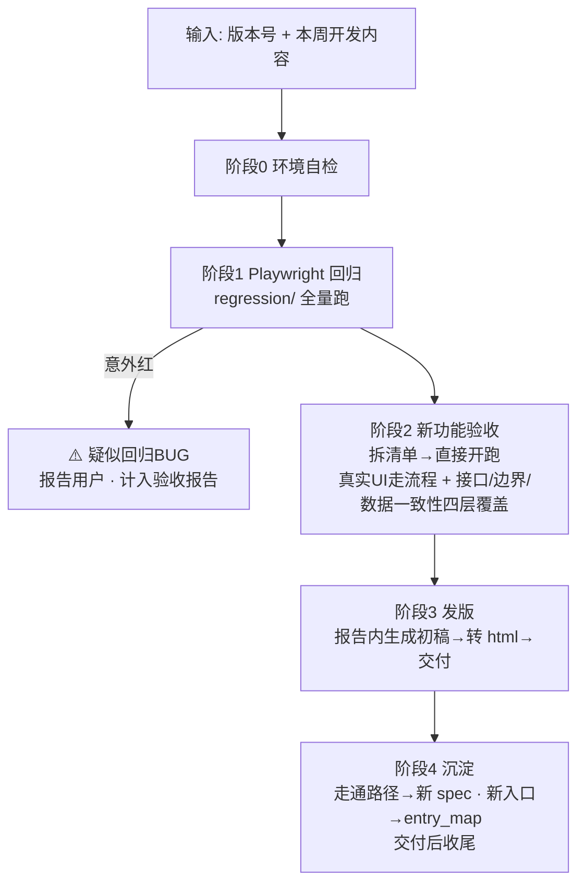

# 51PM 验收-测试-发版 · 全流程总控 SKILL

> **一句话**：用户在 VS Code Copilot 对话框贴「版本号 + 本周开发内容」→ agent 依次跑
> **① 回归（老功能）→ ② 验收（新功能）→ ③ 发版（初稿写进报告并转 html 交付）→ ④ 沉淀（用例+入口）**，
> 每阶段有明确产物。本 SKILL 是调度器，各阶段细节委托给专项 skill 文档。

## 架构总览



## 目录与产物约定

| 内容                         | 位置                                                                                                       |
| ---------------------------- | ---------------------------------------------------------------------------------------------------------- |
| 回归脚本                     | `regression/tests/v{版本}.spec.js`，公共封装 [regression/tests/helpers.js](../regression/tests/helpers.js) |
| 验收报告 + 截图              | `acceptance/{版本}/acceptance-report.md` + `.html` + `final-*.jpg` 等                                      |
| 入口地图（全 skill 共享）    | [skills/entry_map.md](entry_map.md) —— 找入口先查、新入口必回填                                            |
| 发版最终文档（agent 不维护） | 用户自行在发版管理中定稿更新；agent 交付终点=验收报告内的初稿节                                            |

## 关键环境信息

| 项       | 值                                                                                                          |
| -------- | ----------------------------------------------------------------------------------------------------------- |
| 测试环境 | `http://10.67.8.183:7777`（右侧有"当前为开发环境"水印；**验收默认此环境**）                                 |
| 正式环境 | `http://51pm.51aes.com:771`（写操作逐项先问用户；两个 host 均不外发）                                       |
| 后端 API | `10.67.8.183:8888`，前端写死 `localhost:8888` → 回归 globalSetup 自动起本机转发（单独常驻 `npm run proxy`） |
| 测试数据 | 测试库与正式库完全隔离、真实项目只是副本 → **任意项目均可随便挑、直接写，无污染顾虑，不需专用测试项目**     |
| 登录     | 企微 OAuth；登录态过期（用例批量跳登录页）→ 提示用户重跑 `npm run login`，**agent 不代输任何凭据**          |

---

## 阶段 0：环境自检（每轮开跑前）

```powershell
cd regression
# 1. 依赖就绪？（首次或环境恢复才需要）
if (!(Test-Path node_modules)) { npm install; npx playwright install chromium }
# 2. 登录态存在？不存在则提示用户 npm run login（企微客户端点确认，agent 等待）
Test-Path auth/state.json
```

- 登录态**文件存在但已过期**的表现：回归用例批量因跳转登录页失败 → 停下提示用户重登，不要逐条重试。
- **环境固定为测试环境** `10.67.8.183:7777`，不再询问。仅当用户明确说「正式环境」才切换，且写操作逐项问。

## 阶段 1：老功能回归（几分钟，全自动）

```powershell
cd regression
npx playwright test          # 只读用例全量；写链路默认跳过
# 需要跑真实写链路时（会产生测试数据）：
$env:RUN_WRITE=1; npx playwright test --grep @write
```

结果判读（三种颜色三种动作）：

| 结果                                      | 含义                                                       | 动作                                                                           |
| ----------------------------------------- | ---------------------------------------------------------- | ------------------------------------------------------------------------------ |
| 全绿                                      | 老功能没被本次发版改坏（含哨兵用例：BUG 仍在=预期失败=绿） | 直接进阶段 2                                                                   |
| 「已知BUG跟踪」用例 unexpected pass（红） | 开发已修复该 BUG，哨兵用例的 `test.fail()` 标记过时        | 删掉 `test.fail()` 转常规断言，并把 BUG 从 entry_map 备注中销账                |
| 其他用例意外红                            | 疑似回归 BUG                                               | 先复跑一次排除偶发；仍红则看现场，作为 🐛 记入报告继续往下跑，**不中断等用户** |

- 回归失败排查顺序：登录态过期（批量跳登录页）→ 8888 转发没起 → 测试库刷新致数据缺失 → 才是真回归 BUG。
- **测试库刷新致数据缺失**：失败报错含「测试数据缺失 / 被清空需先重建」时，**不要重建数据、不要复跑、不要继续耗时间**——立即终止本轮回归，在报告开头标注「回归跳过：测试库刷新致数据缺失」并列出受影响用例，直接进阶段 2。数据重建只在用户明确要求时做。
- 回归结论（x 通过 / y 失败 / 哨兵状态）写进阶段 2 报告的开头总览。

## 阶段 2：新功能验收（半自动，核心阶段）

**全文遵循** [release_acceptance.md](release_acceptance.md)（拆清单模板 / 四层检查维度 / 截图规范 / 结论分级 / 报告模板 / 发版内容初稿），本节只列调度要点与新环境适配：

1. **拆清单 → 输出后直接开跑**：对开发内容逐条产出「功能名 / 推测入口 / 计划流程 / 观察点」，入口先查 [entry_map.md](entry_map.md)，查不到的标"待现场找"现场探索。清单发出去即开始验收，仅当开发内容有明显歧义、无法推进时才提问。一次只带 1~2 个功能，多了分批。
2. **必须真实 UI 交互**：验收是在验交互本身——点不动的按钮就是 🐛 发现，禁止用 JS 直写绕过。读 Vue data / DOM 只用于**数据断言**，不代替操作。
   - **唯一例外：前置数据准备撞上权限门禁**。造前置数据的环节（非被验功能）遇到前端角色/白名单禁用按钮（如 PM 审批 `systemRole!=='PM'`、QA递交 `testListRooters` 白名单）：**不要尝试右上角切换角色**（切回可能触发重新扫码，登录态报废），也不要对着禁用按钮死循环重试；标准手法是：读按钮 Vue 组件找到背后的处理方法（如 `approvedApply(row)`）直接调用打开表单，后续表单交互仍走真实点击；同时把「前端禁用但后端放行」作为 ⚠️ 写进报告（后端缺校验线索）。
3. **执行载体（新环境适配）**：优先用 Copilot 浏览器工具（打开页面、点击、截图）现场探索；复杂流程可写临时 Playwright 脚本（复用 `helpers.js` 里的坑规避封装：公告弹窗关闭、可见 dialog 过滤、双份渲染过滤等）。临时脚本验完即弃或直接进化为阶段 4 的正式用例。
4. **四层覆盖**：每个功能默认过「UI 流程 / 边界 / 接口层 / 数据一致性」，验不了的层在报告标 ⚠️+原因。其中接口层是**硬性要求**：每个功能至少直调 1 次核心接口（页面内 `fetch` 复用会话）验边界参数（非法值、越权 id、空参），并把接口路径+关键参数记进报告与 entry_map 备注（供阶段 4 沉淀接口回归用）。
5. **截图纪律**：只截三类——关键结果页（每功能 1~2 张）、BUG 现场（必截）、定妆图 `final-{功能名}.jpg`（每功能 1 张，发版文档引用）。落盘 `acceptance/{版本}/`。
   - **交付截图一律用 headless Playwright 脚本截，禁止用集成浏览器出图**（集成浏览器视口会被 VS Code 回弹到 ~1390，截图右 1/4 留白；详见 [release_acceptance.md](release_acceptance.md)）。集成浏览器只做探索交互；验收尾声用 `regression/scripts/headless-login.js`（launchLoggedIn+shot，登录/公告/视口断言已封装）写一个重放脚本把全部交付截图一次截完。
6. **结论分级**：✅ 通过 / 🐛 BUG（复现步骤+预期 vs 实际+严重度）/ ⚠️ 需人工复核（权限、后端定时逻辑、视觉细节等写明原因）。
7. **报告**：按 release_acceptance.md 第 4 步模板写 `acceptance/{版本}/acceptance-report.md`，开头补一节「回归结果」（阶段 1 结论）；实体一律写「名称（#ID）」。
8. **本阶段暂不转 HTML**：只写报告 md；html 统一在**阶段 3 发版初稿回填报告之后**转一次（否则 html 缺发版节）。转换细节见阶段 3 与 [release_acceptance.md](release_acceptance.md)。

## 阶段 3：发版（初稿必做，报告写全→转 html→交付）

1. **生成初稿**：**只依赖两个输入：本轮验收结果 + [release_notes.md](release_notes.md) 规范**（分类判断表 / 强度规则 / 句式 / 红黑榜 / 命名规范，必须真正读取并逐条套用，不许凭感觉写）。**不读、不碰发版记录/发版.md——任何阶段都不碰**（定稿与归档由用户在发版管理自行完成，agent 只专注输出验收报告；历史版本归属拿不准时在初稿里标 ⚠️ 留待定稿判断，不去翻历史）。四个高频判错点：
   - 产出物是全新能力/独立页面 → **新增功能**，哪怕挂在已有页面上
   - 新增用户可感知核心能力 → 强度至少**中等**；强度按 **dev_notes 全部条目**判（含未验收/验不了的条目；dev_notes 即本次发版范围，不去翻发版记录确认）
   - 🐛 对外**转正向表述**，不暴露"曾出异常"；内部 BUG 放报告「交付前需人工确认」节
   - 价值括号写业务结果（降低成本/减少人工），不写功能能力（支持XX）
2. **初稿写进验收报告**的「## 发版内容（初稿，待人工定稿）」节——不落独立文件；定妆图直接引用 `acceptance/{版本}/final-*.jpg`，不拷贝。
3. **转 HTML（全流程唯一一次转换，发版初稿写回之后才转）**：至此报告 md 已写全（回归结果 + 各功能结论 + 发版初稿），转成 html——md 与 html 是同一份完整交付物。转换命令、排版与踩坑见 [release_acceptance.md](release_acceptance.md)；pandoc 不可用时用任何等效 md→html 手段，保持相对路径图片可见；转换失败不阻断，md 是主产物。
4. **交付**：把报告与截图目录路径发回用户（Windows 格式）。**至此对外交付物完成**，定稿与归档由用户在发版管理自行完成。
5. 若用户主动提供定稿与初稿的措辞差异，作为反例回填 release_notes.md 相应章节；若用户改了报告 md，重转一次 html 保持交付物同步。

## 阶段 4：沉淀（交付后收尾，建设下轮回归资产，不等用户提醒）

> 本阶段产出下一轮的回归资产（spec 用例、入口地图），**不写进本轮验收报告、不影响已交付的 md/html**，所以放在发版交付之后收尾——不要插到验收报告与发版初稿之间打断报告成文。

1. **走通路径 → 回归用例**：把本轮验收走通的每个功能路径追加成 `regression/tests/v{版本}.spec.js`，下周它自动进回归。写用例规范：
   - 默认**只读断言**（不产生测试数据）；完整写链路加 `@write` 标签 + `test.skip(!process.env.RUN_WRITE, ...)`
   - **数据依赖分层**（测试库不定期刷新，写死具体 ID/记录会每轮误报红）：静态 UI 要素（按钮/tab/表头/文档位标签）**硬断言**；依赖验收落库数据的部分改「**动态发现 → 找不到 `test.skip` 注明恢复方法**」（如：接口扫任意符合形态的数据代替固定 ID/名称；全库筛状态代替具体记录）
   - 本轮未修复的 🐛 写成「已知BUG跟踪」哨兵用例：正常断言"应有响应/应正确"+ `test.fail(true, 'BUG描述')` 标记（未修复=预期失败=绿；修复后 unexpected pass 报红提醒删标记转常规断言）
   - 通用坑（弹窗遮挡、双份渲染、重定向）优先复用/扩充 `helpers.js`，函数上注释坑的来龙去脉
   - 写完跑一遍新 spec 确认能过：`npx playwright test tests/v{版本}.spec.js`
2. **接口回归用例**：验收中确认过的核心接口（阶段 2 第 4 条记录的路径+参数）沉淀成 `regression/tests/api-v{版本}.spec.js`，用 Playwright `request` fixture 纯接口断言（不开浏览器，秒级跑完）：正常参数验状态码+响应结构，边界参数（非法值/空参）验不报 500；登录态复用 `storageState` 的 cookie，只读接口为主，写接口同样走 `@write` 规范
3. **入口回填**：本轮**新确认**和**纠正**的入口立即写入 [entry_map.md](entry_map.md)，同入口踩到的坑以 ⚠️ 写进备注列。这是强制项，每轮都做。

---

## 人工确认点汇总（尽可能少，中途不中断）

> **流程中途不设任何询问确认环节**：发现的问题（疑似 BUG、权限受阻、理解歧义）一律记录进报告的「交付前需人工确认」表后继续往下跑，跑完在总结里一次性呈现。仅保留以下硬性停预：

| 时机                          | 确认什么                                     |
| ----------------------------- | -------------------------------------------- |
| 登录态失效且 SSO 无法自动续登 | 让用户扫码（agent 不代输凭据）               |
| 正式环境任何写操作            | 逐项先问（仅用户明确要求正式环境时才会发生） |

> 「不问直接干」四条：① 环境固定测试环境；② 验收清单输出后直接开跑；③ 遇测试数据缺失（测试库刷新所致）→ 换个符合形态的项目/动态找继续，或按阶段 1 规则跳过，不重建、不空等；④ 疑似回归 BUG 先复跑排除偶发，确认后记入报告继续跑，不中断。

## 安全红线（继承自各专项 skill）

1. 测试环境写操作可直接做，测试数据不需清理；**正式环境写操作逐项先问**。
2. 不删除任何已有数据（含测试环境）。
3. 登出 / 企微扫码 / 二次验证：暂停问用户，不代输凭据。
4. 两套环境 host 不写进外发文档/截图标注。

## 专项 skill 索引（本 SKILL 的下游依赖）

| skill                                          | 职责                                                    |
| ---------------------------------------------- | ------------------------------------------------------- |
| [release_acceptance.md](release_acceptance.md) | 阶段 2 全部细节：清单模板、四层维度、截图规范、报告模板 |
| [release_notes.md](release_notes.md)           | 阶段 3 发版内容撰写规范：分类/强度/句式/红黑榜          |
| [entry_map.md](entry_map.md)                   | 入口地图：先查后填，唯一权威                            |
| [README.md](README.md)                         | 51PM 站点结构、模块路由、Vue 直写技巧（仅数据断言用）   |
| [references/](references/)                     | 历轮实测沉淀笔记（验收技巧、入口勘察）                  |
