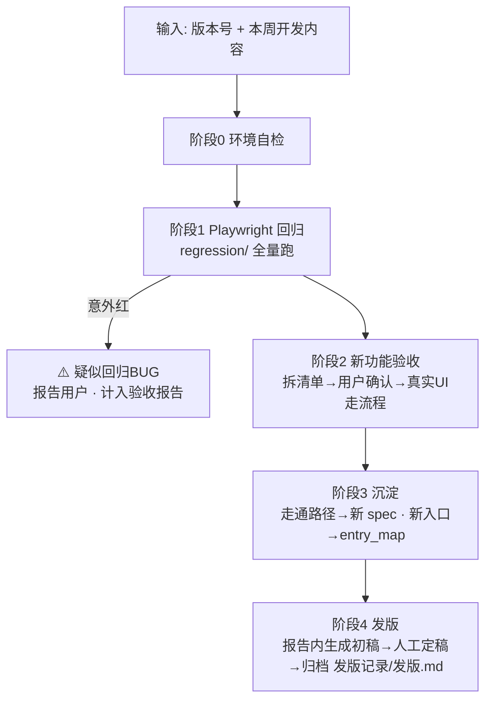

# 51PM 验收-测试-发版 · 全流程总控 SKILL

> **一句话**：用户在 VS Code Copilot 对话框贴「版本号 + 本周开发内容」→ agent 依次跑
> **① 回归（老功能）→ ② 验收（新功能）→ ③ 沉淀（用例+入口）→ ④ 发版（初稿+归档）**，
> 每阶段有明确产物与人工确认点。本 SKILL 是调度器，各阶段细节委托给专项 skill 文档。

## 与旧流程的关系

Hermes/飞书时代的旧流程（CDP Chrome、WSL gateway、飞书机器人驱动）已弃用并删除，本 SKILL 是唯一现行流程。当前执行环境：

| 项 | 旧（Hermes） | 新（本 SKILL） |
|---|---|---|
| 驱动方式 | 飞书消息 → WSL gateway → BrowserHarness | VS Code Copilot 对话框直接驱动 |
| 浏览器 | CDP 接管的 automation Chrome | Playwright（回归脚本）/ Copilot 浏览器工具（探索验收） |
| 登录态 | Chrome 常驻登录 | `regression/auth/state.json`（`npm run login` 企微扫码生成） |
| 产物路径 | WSL symlink 混合路径 | 本仓库内 Windows 路径，全部相对 `d:\project\51PM验收-测试-发版\` |
| 老功能保障 | 无（每轮全手工重验） | Playwright 回归脚本自动跑 |

## 架构总览



## 目录与产物约定

| 内容 | 位置 |
|---|---|
| 回归脚本 | `regression/tests/v{版本}.spec.js`，公共封装 [regression/tests/helpers.js](../regression/tests/helpers.js) |
| 验收报告 + 截图 | `acceptance/{版本}/acceptance-report.md` + `.html` + `final-*.jpg` 等 |
| 入口地图（全 skill 共享） | [skills/entry_map.md](entry_map.md) —— 找入口先查、新入口必回填 |
| 发版最终文档 | `发版记录/发版.md`（发布记录表 + 版本详情，新版本插最上方） |

## 关键环境信息

| 项 | 值 |
|---|---|
| 测试环境 | `http://10.67.8.183:7777`（右侧有"当前为开发环境"水印；**验收默认此环境**） |
| 正式环境 | `http://51pm.51aes.com:771`（写操作逐项先问用户；两个 host 均不外发） |
| 后端 API | `10.67.8.183:8888`，前端写死 `localhost:8888` → 回归 globalSetup 自动起本机转发（单独常驻 `npm run proxy`） |
| 测试项目 | 邓欣羽的测试项目 #6712（SJ202607100001）；递交历史数据用 千岛湖升级优化项目 #6662 |
| 登录 | 企微 OAuth；登录态过期（用例批量跳登录页）→ 提示用户重跑 `npm run login`，**agent 不代输任何凭据** |

---

## 阶段 0：环境自检（每轮开跑前）

```powershell
cd regression
# 1. 依赖就绪？（首次或环境恢复才需要）
if (!(Test-Path node_modules)) { npm install; npx playwright install chromium }
# 2. 登录态存在？不存在则提示用户 npm run login（企微客户端点确认，agent 等待）
Test-Path auth/state.json
```

- 登录态**文件存在但已过期**的表现：回归用例批量因跳转登录页失败 → 停下提示用户重登，不要逐条重试。
- 用户没写明环境时**必须问清楚**（默认测试环境，但要确认功能已部署到测试环境）。

## 阶段 1：老功能回归（几分钟，全自动）

```powershell
cd regression
npx playwright test          # 只读用例全量；写链路默认跳过
# 需要跑真实写链路时（会产生测试数据）：
$env:RUN_WRITE=1; npx playwright test --grep @write
```

结果判读（三种颜色三种动作）：

| 结果 | 含义 | 动作 |
|---|---|---|
| 全绿 | 老功能没被本次发版改坏 | 直接进阶段 2 |
| 「已知BUG跟踪」用例红 | 正常——这是故意断言"BUG 应已修复"的哨兵用例 | 若**转绿**说明开发已修复：把该用例改成常规断言，并把 BUG 从 entry_map 备注中销账 |
| 其他用例意外红 | 疑似回归 BUG | `npx playwright show-report` 看现场；确认后作为 🐛 计入本轮验收报告，并立即告知用户 |

- 回归失败排查顺序：登录态过期（批量跳登录页）→ 8888 转发没起 → 才是真回归 BUG。
- 回归结论（x 通过 / y 失败 / 哨兵状态）写进阶段 2 报告的开头总览。

## 阶段 2：新功能验收（半自动，核心阶段）

**全文遵循** [release_acceptance.md](release_acceptance.md)（拆清单模板 / 四层检查维度 / 截图规范 / 结论分级 / 报告模板 / 发版素材预写），本节只列调度要点与新环境适配：

1. **拆清单 → 用户确认后才动手**：对开发内容逐条产出「功能名 / 推测入口 / 计划流程 / 观察点」，入口先查 [entry_map.md](entry_map.md)，查不到的在清单里标"待现场找"让用户勾选纠正。一次只带 1~2 个功能，多了分批。
2. **必须真实 UI 交互**：验收是在验交互本身——点不动的按钮就是 🐛 发现，禁止用 JS 直写绕过。读 Vue data / DOM 只用于**数据断言**，不代替操作。
3. **执行载体（新环境适配）**：优先用 Copilot 浏览器工具（打开页面、点击、截图）现场探索；复杂流程可写临时 Playwright 脚本（复用 `helpers.js` 里的坑规避封装：公告弹窗关闭、可见 dialog 过滤、双份渲染过滤等）。临时脚本验完即弃或直接进化为阶段 3 的正式用例。
4. **四层覆盖**：每个功能默认过「UI 流程 / 边界 / 接口层 / 数据一致性」，验不了的层在报告标 ⚠️+原因。
5. **截图纪律**：只截三类——关键结果页（每功能 1~2 张）、BUG 现场（必截）、定妆图 `final-{功能名}.jpg`（每功能 1 张，发版文档引用）。落盘 `acceptance/{版本}/`。
6. **结论分级**：✅ 通过 / 🐛 BUG（复现步骤+预期 vs 实际+严重度）/ ⚠️ 需人工复核（权限、后端定时逻辑、视觉细节等写明原因）。
7. **报告**：按 release_acceptance.md 第 4 步模板写 `acceptance/{版本}/acceptance-report.md`，开头补一节「回归结果」（阶段 1 结论）；实体一律写「名称（#ID）」。
8. **转 HTML 时机**：等阶段 4 发版内容回填进报告**之后**再转（否则 html 缺发版节）。pandoc 不可用时用任何等效 md→html 手段，保持相对路径图片可见；转换失败不阻断，md 是主产物。

## 阶段 3：沉淀（验收通过后立即做，不等用户提醒）

1. **走通路径 → 回归用例**：把本轮验收走通的每个功能路径追加成 `regression/tests/v{版本}.spec.js`，下周它自动进回归。写用例规范：
   - 默认**只读断言**（不产生测试数据）；完整写链路加 `@write` 标签 + `test.skip(!process.env.RUN_WRITE, ...)`
   - 本轮未修复的 🐛 写成「已知BUG跟踪」哨兵用例（断言"应有响应/应正确"，当前预期红，修复后自动转绿）
   - 通用坑（弹窗遮挡、双份渲染、重定向）优先复用/扩充 `helpers.js`，函数上注释坑的来龙去脉
   - 写完跑一遍新 spec 确认能过：`npx playwright test tests/v{版本}.spec.js`
2. **入口回填**：本轮**新确认**和**纠正**的入口立即写入 [entry_map.md](entry_map.md)，同入口踩到的坑以 ⚠️ 写进备注列。这是强制项，每轮都做。

## 阶段 4：发版（初稿必做，定稿归人工）

1. **生成初稿**：**必须真正读取并逐条套用** [release_notes.md](release_notes.md)（分类判断表 / 强度规则 / 句式 / 红黑榜 / 命名规范），不许凭感觉写。四个高频判错点：
   - 产出物是全新能力/独立页面 → **新增功能**，哪怕挂在已有页面上
   - 新增用户可感知核心能力 → 强度至少**中等**；强度按发版全集判（可能含未验收模块）
   - 🐛 对外**转正向表述**，不暴露"曾出异常"；内部 BUG 放报告「交付前需人工确认」节
   - 价值括号写业务结果（降低成本/减少人工），不写功能能力（支持XX）
2. **初稿写进验收报告**的「## 发版内容（初稿，待人工定稿）」节——不落独立文件；定妆图直接引用 `acceptance/{版本}/final-*.jpg`，不拷贝。写完再转 html（见阶段 2 第 8 条）。
3. **人工定稿**：用户修改初稿后，agent 协助归档到 [发版记录/发版.md](../发版记录/发版.md)：
   - 「一、发布记录」表补新版本行（版本号 / 更新时间 / ≤30 字摘要 / 影响角色）
   - 「三、版本详情」最上方插入完整版本块
   - 被用户纠正的措辞差异，作为反例回填 release_notes.md 相应章节
4. 报告 md 被定稿修改后重转一次 html，交付物始终是 `acceptance/{版本}/` 整目录（md + html + 截图）。

---

## 人工确认点汇总（agent 必须停下来等用户的地方）

| 时机 | 确认什么 |
|---|---|
| 阶段 0 | 环境（测试/正式）未明说时问清；登录态失效让用户扫码 |
| 阶段 2 开跑前 | 验收清单（功能理解 + 入口推测）确认后才动手 |
| 正式环境任何写操作 | 逐项先问 |
| 阶段 1/2 发现疑似回归 BUG | 立即告知，确认是 BUG 还是环境问题 |
| 阶段 4 | 发版初稿 → 人工定稿；归档前确认最终稿 |

## 安全红线（继承自各专项 skill）

1. 测试环境写操作可直接做，测试数据不需清理；**正式环境写操作逐项先问**。
2. 不删除任何已有数据（含测试环境）。
3. 登出 / 企微扫码 / 二次验证：暂停问用户，不代输凭据。
4. 两套环境 host 不写进外发文档/截图标注。

## 专项 skill 索引（本 SKILL 的下游依赖）

| skill | 职责 |
|---|---|
| [release_acceptance.md](release_acceptance.md) | 阶段 2 全部细节：清单模板、四层维度、截图规范、报告模板 |
| [release_notes.md](release_notes.md) | 阶段 4 发版内容撰写规范：分类/强度/句式/红黑榜 |
| [entry_map.md](entry_map.md) | 入口地图：先查后填，唯一权威 |
| [README.md](README.md) | 51PM 站点结构、模块路由、Vue 直写技巧（仅数据断言用） |
| [references/](references/) | 历轮实测沉淀笔记（验收技巧、入口勘察） |
