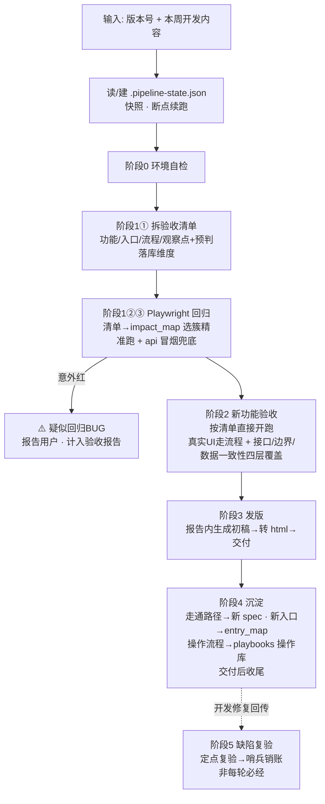

# 51PM 验收-测试-发版 · 全流程总控 SKILL

> **一句话**：用户在 VS Code Copilot 对话框贴「版本号 + 本周开发内容」→ agent 依次跑
> **① 回归（老功能）→ ② 验收（新功能）→ ③ 发版（初稿写进报告并转 html 交付）→ ④ 沉淀（用例+入口）**，
> 每阶段有明确产物。
>
> **本文件是「总控/调度器」，不含执行细则**：每个阶段的具体步骤都在 `stages/` 子文档里（见下方「阶段路由表」）。
> 进入某阶段的第一动作 = 用 `read_file` 读取该阶段对应的 `stages/*.md`，再照它执行。主文件只负责编排、状态与红线。

## 架构总览


```mermaid
graph TD
    A[输入: 版本号 + 本周开发内容] --> S[读/建 .pipeline-state.json<br>快照 · 断点续跑] --> B[阶段0 环境自检]
    B --> C0[阶段1① 拆验收清单<br>功能/入口/流程/观察点+预判落库维度]
    C0 --> C[阶段1②③ Playwright 回归<br>清单→impact_map 选簇精准跑 + api 冒烟兜底]
    C -->|意外红| C1[⚠️ 疑似回归BUG<br>报告用户 · 计入验收报告]
    C --> D[阶段2 新功能验收<br>按清单直接开跑<br>真实UI走流程 + 接口/边界/数据一致性四层覆盖]
    D --> E[阶段3 发版<br>报告内生成初稿→转 html→交付]
    E --> F[阶段4 沉淀<br>走通路径→新 spec · 新入口→entry_map<br>操作流程→playbooks 操作库<br>交付后收尾]
    F -. 开发修复回传 .-> G[阶段5 缺陷复验<br>定点复验→哨兵销账<br>非每轮必经]
```

## 目录与产物约定

| 内容 | 位置 |
| --- | --- |
| 回归脚本 | `regression/tests/v{版本}.spec.js`，公共封装 [helpers.js](../regression/tests/helpers.js) |
| 验收报告 + 截图 | `acceptance/{版本}/acceptance-report.md` + `.html` + `final-*.jpg`；有缺陷时另出 `fix-handoff.md`（开发修复交接物，规范见 [stages/stage2-acceptance.md](stages/stage2-acceptance.md) §5） |
| 流水线状态（断点续传） | `acceptance/{版本}/.pipeline-state.json` —— 每阶段完成即写盘，唤起先读快照续跑（见「状态写盘与断点续传」节） |
| 入口地图（全 skill 共享） | [entry_map.md](entry_map.md) —— 找入口先查、新入口必回填 |
| 影响面索引（全 skill 共享） | [impact_map.md](impact_map.md) —— 功能↔共享表/接口，反查回归目标；新功能确认落库口径后必回填 |
| 踩坑台账（全 skill 共享） | [pitfalls-ledger.md](pitfalls-ledger.md) —— 阶段 0 必读逐条自查；新坑按收录标准入账 |
| 操作库 / Playbooks（SOP） | [playbooks/](playbooks/) —— 每个功能「怎么做完一件事」的分步流程，供人/操作型 AI 复用 |
| 发版最终文档（agent 不维护） | 用户自行在发版管理中定稿更新；agent 交付终点 = 验收报告内的初稿节 |

## 关键环境信息

| 项 | 值 |
| --- | --- |
| 测试环境 | `http://10.67.8.183:7777`（右侧有"当前为开发环境"水印；**验收默认此环境**） |
| 正式环境 | `http://51pm.51aes.com:771`（写操作逐项先问用户；两个 host 均不外发） |
| 后端 API | 真实后端 `10.67.8.189:8888`。**IP 会漂移**（2026-07-21 前从 .183 迁到 .189），单一真源见 [start-proxy.js](../regression/scripts/start-proxy.js) 的 `TARGET_HOST`。前端写死 `localhost:8888` → 回归 globalSetup 自动起本机转发（单独常驻 `npm run proxy`）。判断当前后端 IP：浏览器打开 app 看 performance 里 `manage_api` 请求 host |
| 测试数据 | 测试库与正式库完全隔离、真实项目只是副本 → **任意项目均可随便挑、直接写，无污染顾虑，不需专用测试项目** |
| 登录 | 企微 OAuth；登录态过期（用例批量跳登录页）→ 提示用户重跑 `npm run login`，**agent 不代输任何凭据** |

---

## 状态写盘与断点续传（每次唤起的第 1 步，先于阶段 0）

一轮流水线的进度必须落盘 `acceptance/{版本}/.pipeline-state.json`，**不靠对话上下文记进度**——回归 10+ 分钟、验收分批、复验跨天，会话随时可能断。

**启动握手**：每次被唤起（含阶段 5 复验触发）先找该文件：

- **存在** → 读入并输出一行快照（如 `0✅ 1✅ 2🚧(3/5功能) 3⬜ 4⬜ | 未闭环: B1待复验`），从第一个未完成处续跑，**已 passed 的阶段不重跑**；
- **不存在** → 建版本目录时一并新建，从阶段 0 开始。

**写盘红线**：

- 每阶段完成即写 `stages.N = {status:"passed", at, note}`；**无写盘记录 = 该阶段没做过**，不接受口头追认；
- 阶段 1 拆出的**验收清单写进顶层 `checklist[]`**（每项 name/entry/预判 tables），阶段 2「不重拆、直接按清单开跑」全靠它——会话断在阶段 1↔2 之间时清单不丢；
- 老功能被本轮重构、需在阶段 4 就地改旧 spec 的，阶段 1 判读时登记进顶层 `pendingSpecUpdates[]`，阶段 4 核销时逐项清零（跨阶段传递载体）；
- 阶段 2 按功能粒度记 `features[]`（名称/结论/四层完成度/截图有无），分批验收的断点全靠它；
- 阶段 4 必须填满核销清单才准 `passed`（见阶段 4 第 6 条）；用户显式豁免某项时记 `skipped-by-user + 理由`；
- 阶段 5 复验结果追加进 `history[]`，不另建状态文件。

最小 schema（字段可增不可省）：

```json
{ "version": "V2.x.x", "devNotes": "…", "updatedAt": "",
  "checklist": [
    { "name": "递交日历", "entry": "递交列表→切换至日历视图", "tables": ["project_publish"] } ],
  "pendingSpecUpdates": [ "v2.2.6③ 概况改手风琴 → 就地更新旧 spec" ],
  "stages": {
    "0": { "status": "passed", "at": "" },
    "1": { "status": "passed", "result": "12过/1红/哨兵绿" },
    "2": { "status": "in-progress", "features": [
      { "name": "递交日历", "verdict": "✅", "layers": "ui+边界+接口+一致", "screenshots": true } ] },
    "3": { "status": "not-started" },
    "4": { "status": "not-started", "checklist": {
      "ui-spec": null, "api-spec": null, "entry_map": null, "impact_map": null,
      "playbooks": null, "pitfalls": null, "pendingSpecUpdates": null } } },
  "history": [ { "at": "", "event": "stage-passed", "stage": 1 } ] }
```

## 阶段路由表（核心：编排在此，细则在 stages/）

> **铁律**：进入某阶段的第一动作 = `read_file` 读取下表对应的 `stages/*.md` 再动手；跨阶段不跳步；`.pipeline-state.json` 里已 `passed` 的阶段本轮不重跑。

| 阶段 | 做什么 | 先读文档 | 关键产物 / 写盘 |
| --- | --- | --- | --- |
| **0** 环境自检 | `npm run check` 验登录态/后端；通读踩坑台账 | [stages/stage01-regression.md](stages/stage01-regression.md) | `stages.0=passed` |
| **1** 拆清单+精准回归 | dev_notes 拆验收清单（含预判落库维度）→ 查 impact_map 选簇 `--grep` 精准跑 + api 冒烟兜底 | [stages/stage01-regression.md](stages/stage01-regression.md) | 验收清单 + 回归结论（`stages.1`，写进报告徽章+附录 A.1） |
| **2** 新功能验收 | 按清单逐项真实 UI 验收，四层覆盖（UI/边界/接口/数据一致）→ 写报告 md | [stages/stage2-acceptance.md](stages/stage2-acceptance.md) | `acceptance/{版本}/acceptance-report.md` + `final-*.jpg`；有缺陷出 `fix-handoff.md`；`stages.2.features[]` |
| **3** 发版 | 按 release_notes 规范生成初稿→写回报告→**唯一一次**转 html→交付 | [stages/stage3-release.md](stages/stage3-release.md) | 报告内「发版内容（初稿）」节 + `.html`；`stages.3=passed` |
| **4** 沉淀 | 走通路径→spec、接口→api spec、回填 entry_map/impact_map/playbooks | [stages/stage45-sediment.md](stages/stage45-sediment.md) | 5 项核销写 `stages.4.checklist`，全填才 passed |
| **5** 缺陷复验 | *（非每轮）* 修复回传触发：定点复验→命中簇回归→哨兵销账 | [stages/stage45-sediment.md](stages/stage45-sediment.md) | 报告尾「复验记录」+ `history[]` |

---

## 人工确认点汇总（尽可能少，中途不中断）

> **流程中途不设任何询问确认环节**：发现的问题（疑似 BUG、权限受阻、理解歧义）一律按确定性记录进报告 §二 缺陷 / §三 风险后继续往下跑，跑完在总结里一次性呈现。仅保留以下硬性停预：

| 时机 | 确认什么 |
| --- | --- |
| 登录态失效且 SSO 无法自动续登 | 让用户扫码（agent 不代输凭据） |
| 正式环境任何写操作 | 逐项先问（仅用户明确要求正式环境时才会发生） |

> 「不问直接干」四条：① 环境固定测试环境；② 验收清单输出后直接开跑；③ 遇测试数据缺失（测试库刷新所致）→ 换个符合形态的项目/动态找继续，或按阶段 1 规则跳过，不重建、不空等；④ 疑似回归 BUG 先复跑排除偶发，确认后记入报告继续跑，不中断。

## 安全红线（继承自各专项 skill）

> 「何时停下问用户」见上方**人工确认点汇总**（正式环境写操作、扫码续登），此处只列不可逾越的**行为边界**，不重复停预时机：

1. 测试环境写操作可直接做、测试数据不需清理（写透，别拿"怕污染"当借口跳过验收）；正式环境的界限见人工确认点表。
2. 不删除任何已有数据（含测试环境）。
3. 不代输/代扫任何凭据（登出、企微扫码、二次验证一律交用户）。
4. 两套环境 host 不写进外发文档/截图标注。

## 专项 skill 索引（本 SKILL 的下游依赖）

| skill | 职责 |
| --- | --- |
| [stages/](stages/) | **阶段执行细则（唯一执行来源）**：stage01-regression（阶段 0-1）/ stage2-acceptance（阶段 2）/ stage3-release（阶段 3）/ stage45-sediment（阶段 4-5）——进入某阶段先读对应文档 |
| [release_notes.md](release_notes.md) | 阶段 3 发版内容撰写规范：分类 / 强度 / 句式 / 红黑榜 |
| [entry_map.md](entry_map.md) | 入口地图：先查后填，唯一权威 |
| [impact_map.md](impact_map.md) | 影响面索引：新功能碰哪张表/接口 → 反查同簇老功能 = 回归目标 |
| [playbooks/](playbooks/) | 操作库 SOP：功能「怎么做完一件事」的分步流程，阶段 4 回填 |
| [pitfalls-ledger.md](pitfalls-ledger.md) | 踩坑台账：阶段 0 必读逐条自查；新坑按收录标准入账，正文只留规则 + P-xx 引用 |
| [README.md](README.md) | 51PM 站点结构、模块路由、Vue 直写技巧（仅数据断言用） |
| [references/](references/) | 历轮实测沉淀笔记（验收技巧、入口勘察） |
