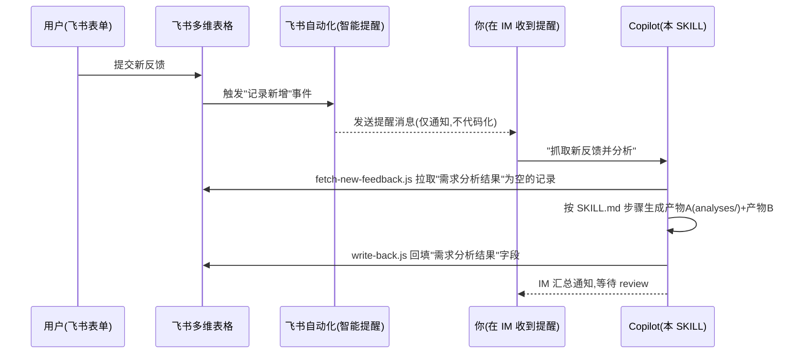

# 飞书接线层 · 使用说明

本目录是 [../SKILL.md](../SKILL.md)（分析大脑）与飞书『51PM 用户反馈表』之间的接线层实现——
对应 SKILL.md「接线层说明」里的**路 B（脚本 + Bitable API）**，采用**半自动**触发：飞书侧的
「智能提醒」只负责通知人，真正的抓取 / 分析 / 回填由你在此对话里驱动 agent 完成。

## 整体流程



## 1. 准备飞书自建应用

1. 打开[飞书开放平台](https://open.feishu.cn/app) → 创建企业自建应用，记下 `App ID` / `App Secret`。
2. 「权限管理」中开通以下任一权限即可（推荐两个都开，读写都要用到）：
   - `bitable:app`（查看、评论、编辑和管理多维表格）
3. 把该应用添加为『51PM 用户反馈表』所在多维表格的**协作者**并给予「可编辑」权限：
   表格右上角「…」→「更多」→「添加文档应用」，选择刚创建的应用。
   （若表格开启了高级权限，还需在高级权限设置里额外给这个应用授权。）

## 2. 获取 app_token / table_id

打开反馈表所在的多维表格，看浏览器地址栏：

- `https://xxx.feishu.cn/base/<app_token>?table=<table_id>&view=...`（URL 以 `base` 开头）
- 若 URL 以 `wiki` 开头，需要先调用「获取知识空间节点信息」接口换取真正的 `app_token`（一次性操作，问 agent 代查）。

## 3. 配置本地凭证

```powershell
Copy-Item .env.example .env
notepad .env
```

按 [.env.example](.env.example) 填好 `FEISHU_APP_ID` / `FEISHU_APP_SECRET` / `FEISHU_APP_TOKEN` / `FEISHU_TABLE_ID`。
若表格列名与 SKILL.md 里的标准字段名不同，再取消对应 `FEISHU_FIELD_*` 行的注释并改成实际列名。

`.env` 已加入 `.gitignore`，不会被提交。

## 4. 在飞书侧配置「智能提醒」（人工通知，纯 UI 配置，无需写代码）

多维表格 →「自动化」→ 新建流程：

- 触发器：`当记录新增时`（或 `当字段值变更时`，条件设为「需求&反馈状态 = 新增」）。
- 动作：`发送提醒`，接收人选自己/相关同事，消息内容随意（如「有新反馈待分析：{{问题描述}}」）。

这一步**只用于让你第一时间知道有新反馈**，不会自动触发下面的抓取脚本——飞书自动化目前没有直接
调用你本机 agent 的能力，所以"抓取→分析→回填"这一段仍由你在 IM 看到提醒后手动触发（对 agent 说
"抓取新反馈并分析"即可，见下方用法）。

## 5. 用法

```powershell
cd skills\feedback-analyzer\scripts

# 抓取「需求分析结果」为空的记录 → 打印 + 写入 .pending-feedback.json
node fetch-new-feedback.js

# 单条回填（问题整理 → 『需求分析结果』，方案推荐 → 『产品|解决方案简述』）
node write-back.js recXXXXXXXX "问题整理文本..." "方案推荐文本..."

# 批量回填（先准备好 JSON：[{"record_id":"rec1","problemSummary":"...","solutionSummary":"..."}]）
node write-back.js --file result-batch.json
```

在对话里直接对 agent 说「抓取新反馈并分析」，agent 会：
1. 跑 `fetch-new-feedback.js` 拿到 `.pending-feedback.json`；
2. 按 [../SKILL.md](../SKILL.md) 的批量预处理 + 分析步骤逐组生成产物 A（存入 [../analyses/](../analyses/)）+ 产物 B；
3. 跑 `write-back.js` 把产物 B 写回对应 `record_id`（合并条目对每个来源 record_id 各写一份相同内容）；
4. IM 按批次汇总通知你 review。

## 现状定位（重要，别误解）

当前是**半自动**：飞书自动化只负责"通知人"，真正的抓取→分析→回填这一段，"分析大脑"是**这个对话里的
agent**，不是一个能被定时任务调用的独立程序——所以还做不到"零触发、完全定时"，需要你看到提醒后
在对话里说一句「抓取新反馈并分析」。这一步已经把"需求分析"本身的脑力成本省掉了，只是省不掉"记得
来说一句话"这个动作。

## 未来升级为「彻底定时全自动」的清单（先梳理，待决策后再实施）

现状跑通、验证分析质量稳定后，如果还想要"完全无人值守、定时自动分析回填"，需要额外做的事、以及每件
事需要你决定/提供的东西：

| # | 要做的事 | 需要你决定/提供什么 | 备注 |
| --- | --- | --- | --- |
| 1 | 脚本里新增"调 LLM API 做分析"这一步（`analyze-with-llm.js`：读 `.pending-feedback.json` + 本仓库语料 entry_map/impact_map/playbooks/pitfalls-ledger + 产品手册，拼 prompt，调大模型，解析出产物A/B） | 用哪个大模型 API（OpenAI / Anthropic Claude / Azure OpenAI 等）+ 对应 API Key | 会产生按量计费的 API 调用成本；模型效果需要用现状人工 review 过的分析结果先验证质量 |
| 2 | 定时触发器 | 跑在 GitHub Actions（云端 cron，仓库要能访问，Key 存到仓库 Secrets）还是本机 Windows 计划任务（需保持开机联网） | 二选一，各有维护成本 |
| 3 | 产品使用手册语料 | 手册目前在飞书文档里，脚本读不到；需要你导出成本地 md 放进仓库，或额外接飞书文档 API | 否则"结合产品手册"这一条会缺一块语料 |
| 4 | 完成后的通知方式 | 是否需要飞书自定义机器人 webhook 群通知，还是继续人工定期去表里看 | 现阶段你选的是"人工定期看"，不需要额外接入 |
| 5 | 质量兜底 | 全自动没有人在中间把关，需要约定"低置信度/需人工确认"的结果如何标记，避免错误分析直接进表 | 建议沿用 SKILL 现有"需人工确认"标注机制 |

**现在按你的决定**：先不做以上任何一项，保持现状（半自动、无 LLM API、无自动通知）。等你把 `.env`
配好、真实跑几轮验证分析质量之后，再回来决定要不要启动这份清单。

## 已知限制

- **问题截图**是附件字段，`fetch-new-feedback.js` 只能拿到文件名，无法自动读图内容；需要看图判断时
  agent 会提示人工打开飞书原记录查看截图。
- **状态过滤**默认关闭（`FEISHU_PENDING_STATUS_VALUES` 留空），此时只要「需求分析结果」为空就会被
  当作待分析；如果你的表里"已拒绝/已归档"等状态也应跳过，请把这些状态**排除**在
  `FEISHU_PENDING_STATUS_VALUES` 白名单之外（该变量是"命中即处理"的白名单，不是黑名单）。
- `tenant_access_token` 有效期 2 小时，`feishu-client.js` 内已做进程内缓存，无需手动刷新。
- 目前不支持真正的"新增即触发"全自动（需要公网可达的 Webhook 接收端或额外部署），如需升级为全自动，
  参考 [../SKILL.md](../SKILL.md) 接线层说明里的「路 A · 飞书 Aily」。
