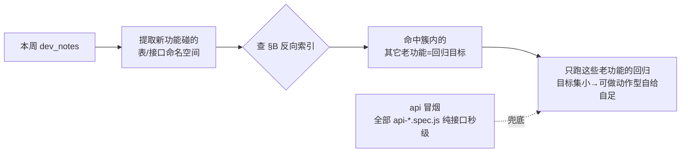

# 51PM — 影响面索引（回归目标推导，全 51pm skill 共享）

> **用途**：把「精准回归」变成查表动作。每轮验收前，从本周 dev_notes 提取新功能碰的**后端表 / 接口命名空间**，来这里反查同表/同接口的**老功能簇**，那一簇就是本轮的回归目标——不靠拍脑袋猜「哪些老功能受影响」。
>
> **与 [entry_map.md](entry_map.md) / [playbooks/](playbooks/) 的分工**：entry_map 记「入口在哪」，playbook 记「怎么做完一件事」，本表记「谁和谁共享后端、改一处波及哪些」。三者不重复。
>
> **维护规则**：每轮阶段4 沉淀时，新功能确认了它读写的表/接口后，① 在 §A 追加该功能一行；② 若它引入了新的共享维度，在 §B 新增一簇；③ 若它挂到已有簇，把功能名加进 §B 对应簇。信息来源=验收报告落库口径 + entry_map 备注里的接口路径。

---

## §A 功能 → 共享维度（正向表）

每个功能读写的核心后端表 / 接口命名空间。多个维度用 `、` 分隔。

| 功能                          | 共享维度（表 / 接口命名空间）                                                        |
| ----------------------------- | ------------------------------------------------------------------------------------ |
| 项目递交（项目内）            | `project_publish`                                                                    |
| 递交列表 → 项目跳转           | `project_publish`（OPStestList 列表）                                                |
| PM 审批递交申请               | `project_publish`（approvedApply、get_normal_const）                                 |
| QA 递交（状态自动判定）       | `project_publish`（testList 白名单）                                                 |
| 递交列表超时递交筛选          | `project_publish`（is_over_tb_time）                                                 |
| TB 递交申请                   | `project_publish`（tb_publish 视图）                                                 |
| 会议动态待办负责人            | `project_moment`（type=1 会议动态）                                                  |
| 项目动态 / 问题动态（V2.2.9） | `project_moment`（module=meet/risk/problem）                                         |
| 项目需求页                    | `demand`（get_project_demand_list）                                                  |
| 自由需求                      | `demand`（create F自由需求）                                                         |
| 需求拆分（拆解为任务）        | `demand`、`project_task`、`task_options`                                             |
| 需求任务列表弹窗              | `project_task`（get_task_list_by_demand_id）                                         |
| 批量创建任务（独立任务）      | `demand`（非项目）、`project_task`                                                   |
| 填写工时                      | `project_task`、`estimate`                                                           |
| 任务完工                      | `project_task`（finish）                                                             |
| 我的任务（日历）              | `project_task`（my_board task 视图）                                                 |
| 我的任务日历-任务卡备注       | `project_task`（任务描述字段）                                                       |
| 创建任务-快速建组群           | `project_task`、`user_group`                                                         |
| 组群配置                      | `user_group`（user_custom_group_config）                                             |
| 从组群导入成员                | `user_group`                                                                         |
| 申请发包（模型外包）          | `outsource`（create_package/get_package_list）                                       |
| 发包审核 / 立项               | `outsource`、`supplier_api`（走供应商时）                                            |
| 外包反馈管理                  | `outsource_feedback`、`outsource_task`、`supplier_api`                               |
| 反馈验收工作台                | `outsource_feedback`（quality_status=2）、`supplier_api`                             |
| 模型数据看板                  | `outsource`（get_data_overview/get_package_dimension_list/get_asset_dimension_list） |
| 供应商企业管理                | `supplier_manage`、`supplier_api`                                                    |
| 供应商端入口（门户登录）      | `supplier_api`（独立后端）                                                           |
| 产能数据看板                  | `data_export`（get_employee_project_list）                                           |
| 项目人员看板                  | `data_export`（get_user_project）                                                    |
| 日报导出（项目日报）          | `estimate`（export_estimate_list_by_project_id）                                     |
| 工时查询统计 / 每日工作概览   | `estimate`（export_daily_estimate）                                                  |
| 排期表搜索项目                | `schedule`（schedule_table）                                                         |
| 排期表过滤空白行列            | `schedule`（纯前端筛选，无独立接口）                                                 |
| 查看个人排期（只读）          | `schedule`                                                                           |
| 项目测试文档                  | `project_detail`（文档位）                                                           |
| 行业接口文档                  | `project_detail`（文档位）                                                           |
| 定制接口文档                  | `project_detail`（文档位）                                                           |
| 批量添加反馈                  | `produce_demand`（add_apply_demand/get_my_demand_list）                              |
| 任务选项配置                  | `task_options`（index/get_task_options）                                             |
| 主题面板                      | `pm_theme`（前端为主，服务端存 18 枚举）                                             |
| 工作台 UGA 入口               | 外部系统（携 token 跳 UGA，无本站表）                                                |
| 工时花费统计（V2.2.9 重构）   | `estimate`（data_export/export_daily_estimate，导出携 userList 等筛选）              |
| ECP 报价查询（V2.2.9）        | `estimate`（data_export/get_ecp_baojia_const、get_ecp_baojia_list）                  |
| 我的项目/非项目视图（V2.2.9） | `project_task`、`demand`（my_board/main/project 合并视图，切换视野）                 |
| 任务列表（V2.2.9 重构）       | `project_task`（project_task 容器，项目/非项目共用+持久化筛选）                      |
| 申请递交表单（V2.2.9 重构）   | `project_publish`（tb_publish，绑定新增/变更/反馈）                                  |
| 我的递交排期日历（V2.2.9）    | `project_publish`（main_panel/get_publish_panel）                                    |
| 递交排期日历视图/季度（V2.2.9）| `project_publish`（OPStestList 列表日历视图）                                       |
| 发包挂起 / 取消（V2.2.9）     | `outsource`（编辑发包状态：挂起/已取消；成本统计联动）                               |
| 项目概况-预估营收时间（V2.2.9）| `project_detail`（project/get_project_info.info.plan_income_date）                  |

---

## §B 共享维度 → 波及功能簇（反向索引，⭐每轮查这里）

**用法**：本轮新功能碰了哪个维度，就把该簇里的**其它老功能**全部纳入回归目标。

### `project_publish`（递交主链，最大簇）

项目递交（项目内）· 递交列表→项目跳转 · PM审批递交申请 · QA递交（状态自动判定）· 递交列表超时递交筛选 · TB递交申请 · 申请递交表单（V2.2.9 重构）· 我的递交排期日历（V2.2.9）· 递交排期日历视图/季度（V2.2.9）

> 改递交状态判定 / 递交筛选 / 递交审批任一处，整簇联动风险高——递交状态枚举、is_over_tb_time、审批流转互相耦合。V2.2.9 起递交排期同时有列表与日历两种视图（我的递交排期日历 = main_panel/get_publish_panel；递交列表日历视图 = OPStestList 季度日历）。

### `project_moment`（项目动态）

会议动态待办负责人 · 项目动态 · 问题动态

> module 字段区分 meet/risk/problem；risk_level 被复用为「影响程度」，status 复用为「解决状态」。新增一种 module 要回归其它 module 的列表/筛选不串。

### `demand`（需求）

项目需求页 · 自由需求 · 需求拆分 · 批量创建任务（独立任务）· 需求任务列表弹窗

> status 枚举 doing/done/wait/pause（V2.2.8 起自动 pause 逻辑）；需求改动常波及其下任务。

### `project_task`（任务）

需求拆分 · 需求任务列表弹窗 · 批量创建任务 · 填写工时 · 任务完工 · 我的任务（日历）· 任务卡备注 · 创建任务快速建组群 · 任务列表（V2.2.9 项目/非项目共用容器重构）· 我的项目/非项目视图（V2.2.9 侧栏合并）

> 任务字段/状态/指派人改动波及工时、日历、完工、需求下钻。⚠️离职人员 assigned_to 保留（V2.2.7 修复点）。⚠️V2.2.9：任务列表项目/非项目共用容器共享持久化筛选（已延宕/本周/全部）；我的任务日历重构为「任务日历/工时确认」tab + 任务以内联 chip（「任务名 | NH」）渲染在日期格（旧「点格出侧栏备注」已废，见 v2.2.6.spec①）；「我的非项目」侧栏菜单已并入「我的项目」。

### `outsource` + `outsource_feedback` + `supplier_api`（模型外包全链）

申请发包 · 发包审核/立项 · 外包反馈管理 · 反馈验收工作台 · 模型数据看板 · 供应商企业管理 · 供应商端入口 · 发包挂起/取消（V2.2.9）

> 管理端建的项目/发包/任务实时同步供应商门户；反馈 quality_status 0/1/2/3 与验收工作台强耦合；自制 vs 供应商分支（isSelfMade）影响反馈 tab 显隐。⚠️V2.2.9：发包状态新增「挂起」「已取消」——取消不计入外包成本统计、挂起可恢复只做/取消，改动发包状态枚举会波及模型数据看板成本汇总（get_data_overview）与发包列表筛选。

### `user_group`（人员组群）

组群配置 · 从组群导入成员 · 创建任务快速建组群

> 组群增删改波及所有「从组群导入」入口的下拉。

### `schedule`（排期表）

排期表搜索项目 · 排期表过滤空白行列 · 查看个人排期

> 同一张 schedule_table 页，筛选/展示改动互相影响。

### `data_export`（统计看板取数）

产能数据看板 · 项目人员看板

> 共用 data_export 取数层，维度/日期/部门参数的边界兜底逻辑共享。

### `estimate`（工时/导出）

填写工时 · 工时查询统计 · 日报导出 · 工时花费统计（V2.2.9 重构，整合导出）· ECP报价查询（V2.2.9）

> 工时数据是三者共同数据源，工时录入口径改动波及统计与导出。⚠️V2.2.9：工时统计重构为 /statistic/export_estimate（每日工作概览/工时数据总览双视图），导出携当前筛选（export_daily_estimate?userList=&export=1）所见即所得；ECP报价查询（get_ecp_baojia_const/list）与工时同挂 data_export 命名空间，对接 ECP4.1（version_id=13）。

### `project_detail`（项目概况文档位）

项目测试文档 · 行业接口文档 · 定制接口文档 · 项目概况-预估营收时间（V2.2.9）

> 三个文档位同区域、互不覆盖是回归重点（历轮易出「链接互相覆盖」类 BUG）；文档位移入折叠「项目信息」手风琴面板。⚠️V2.2.9：「基本信息」面板新增可编辑「预估营收时间」（月精度，get_project_info.info.plan_income_date）；改 get_project_info/项目编辑表单字段会波及文档位与营收字段。

### `task_options`（任务选项配置）

任务选项配置 · 需求拆分（任务选项面板）

> 选项树结构改动波及需求拆解时的任务选项面板。

### 独立维度（暂无同簇老功能，改动一般不外溢）

批量添加反馈（`produce_demand`）· 主题面板（`pm_theme`）· 工作台UGA入口（外部系统）

---

## §C 每轮使用流程

1. **拆 dev_notes → 定维度**：每个新功能落在哪张表/哪个接口命名空间——在总控 SKILL 阶段 1 ① 拆验收清单时以「预判落库维度」行产出（验收实锤口径后若与预判不符，补跑差集簇纠偏）。
2. **查 §B → 得目标集**：命中簇里的其它老功能就是本轮必回归项；命中「独立维度」则该功能基本不外溢，只回归自身。
3. **跑目标集**：命中几个簇就 `--grep "@A|@B|@C…"` 全 grep 上（簇多也照跑，这才是"精准测全部"），这些老功能优先写成/改成**动作型自给自足**用例（自造前置→执行→验证），不依赖遗留数据、不 skip。
4. **兜底冒烟**：跑全部 `api-*.spec.js`（纯接口不开浏览器，秒级），验后端契约防漏判；UI 全量仅在**影响面根本界定不了**时才兜底（功能↔簇映射普遍拿不准，或全局底座改动无法归簇）——**簇多本身不触发全量**。
